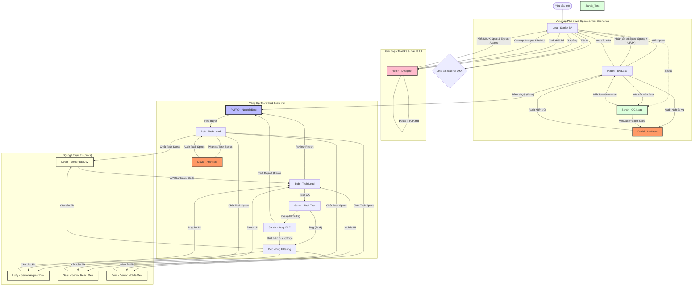

# Agentic Workflow - Ezi Solutions Project Management

Tài liệu này mô tả quy trình phối hợp giữa 5 Agent (Lina, Mattin, Bob, David, Sarah) và PM/PO.

## 1. Sơ đồ Workflow tổng thể (Cập nhật có Sarah)

## 2. Chi tiết vai trò các Agent

### [Lina - Senior Business Analyst](file:///c:/ezi-solutions/autodev/autodev.docs/lina-senior-ba/AGENTS.md)
Sản xuất Spec chi tiết. Chốt ý tưởng thiết kế với Robin.

### [Robin - UI/UX Designer](file:///c:/ezi-solutions/autodev/autodev.docs/robin-ui-ux-designer/AGENTS.md)
"Người gác cổng thẩm mỹ". Quản trị thiết kế thông qua **[STITCH.md](file:///c:/ezi-solutions/autodev/autodev.docs/guidelines/repository-level/STITCH.md)**, sinh thiết kế qua Stitch/Image Gen và viết `ui_ux_spec.md`.

### [Mattin - BA Lead](file:///c:/ezi-solutions/autodev/autodev.docs/mattin-ba-lead/AGENTS.md)
"Người gác cổng nghiệp vụ". Audit Lina, Robin và Sarah.

### [David - System Architect](file:///c:/ezi-solutions/autodev/autodev.docs/david-system-architect/AGENTS.md)
"Người gác cổng kiến trúc". Audit Specs, giải pháp kỹ thuật và phương pháp Automation.

### [Sarah - QC Lead](file:///c:/ezi-solutions/autodev/autodev.docs/sarah-qc-lead/AGENTS.md)
"Cảnh sát chất lượng". Blackbox tester (Pytest/Playwright/Appium/Requests).

### [Bob - Tech Lead](file:///c:/ezi-solutions/autodev/autodev.docs/bob-tech-lead/AGENTS.md)
"Người thực thi chiến lược". Phân rã task, review code và lọc bug.

### [Kevin - Senior Backend Dev](file:///c:/ezi-solutions/autodev/autodev.docs/kevin-senior-be-dev/AGENTS.md)
"Bàn tay thực thi BE". Chuyên gia Clean Code (Java/Spring Boot).

### [Luffy - Senior Angular Dev](file:///c:/ezi-solutions/autodev/autodev.docs/luffy-senior-angular-dev/AGENTS.md)
"Bàn tay thực thi FE (Angular)". Chuyên gia Pixel Perfect (Angular/Nebular).

### [Sanji - Senior React Dev](file:///c:/ezi-solutions/autodev/autodev.docs/sanji-senior-react-dev/AGENTS.md)
"Bàn tay thực thi FE (React/Next)". Chuyên gia Next.js và TailwindCSS.

### [Zoro - Senior Mobile Dev](file:///c:/ezi-solutions/autodev/autodev.docs/zoro-senior-mobile-dev/AGENTS.md)
"Bàn tay thực thi Mobile". Chuyên gia Flutter và React Native.

## 3. Quy tắc Audit chéo
- **Sarah (QC)** bị Mattin audit về nghiệp vụ và David audit về kỹ thuật test.
- **Mattin (BA)** bị David audit về ranh giới hệ thống.
- **Bob (Tech)** bị David audit về kiến trúc task.
- **PM/PO** là người chốt cuối cùng mọi tranh chấp.
