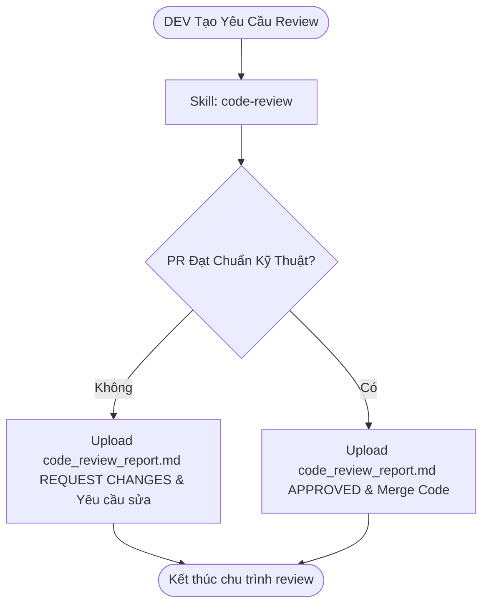

# Workflow: Accept Completed Task

## Description
Quy trình Tech Lead Bob nghiệm thu chất lượng công việc của Lập trình viên (DEV) sau khi họ hoàn thành nhiệm vụ. Tiến trình bao gồm việc kiểm duyệt mã nguồn thực tế trong Pull Request đối chiếu với 11 file tiêu chuẩn `repository-level` và kế hoạch lập ra trong `task-todo.md`, sau đó gửi báo cáo review chất lượng lên hệ thống.

## Triggers
- Khi Lập trình viên (DEV) báo cáo hoàn tất code, push code lên nhánh tính năng và tạo Pull Request (yêu cầu review).

## Mermaid Diagram

## Steps (Bảng Execution Steps Matrix)

| # | Bước thực hiện | Actor | Tool / Skill Mã hóa | Kết quả đầu ra |
|---|---|---|---|---|
| 1 | Thực hiện kiểm duyệt Code Review | Bob | `[code-review](../skills/code-review/SKILL.md)` | So sánh code thay đổi và `task-todo.md` với bộ 11 tiêu chuẩn của Repo, ghi nhận kết quả và upload file báo cáo `code_review_report.md` lên hệ thống qua `upload_task_doc`. |

## Definition of Done
- [ ] Đã kiểm tra sự có mặt và tính hợp lệ của tài liệu lập kế hoạch `task-todo.md` của Dev.
- [ ] Toàn bộ các dòng code thay đổi trong Pull Request được đối chiếu chi tiết với các tiêu chuẩn trong `guideline://REPOSITORY/...`.
- [ ] Báo cáo `code_review_report.md` được ghi nhận rõ ràng kết luận (APPROVED để merge và đẩy lên Staging, hoặc REQUEST CHANGES yêu cầu Dev sửa đổi) và upload thành công lên hệ thống dưới Task tương ứng.
