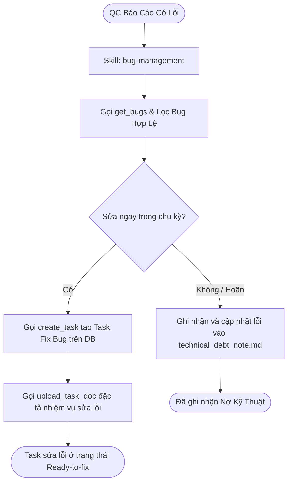

# Workflow: Bug Management

## Description
Quy trình Tech Lead Bob xử lý và điều phối các lỗi (Bugs) phát sinh do Kiểm thử viên (Sarah) báo cáo trên hệ thống. Chu trình bao gồm việc kéo danh sách lỗi về, phân loại và sàng lọc lỗi không hợp lệ, phân rã tạo task sửa lỗi gán Repo, viết đặc tả sửa lỗi `task_spec.md` để chuyển sang Ready-to-fix, hoặc ghi nhận các lỗi trì hoãn/nợ kỹ thuật vào file nợ `technical_debt_note.md`.

## Triggers
- Khi Sarah (QC Lead) báo cáo đã hoàn thành kiểm thử trên môi trường Staging và log danh sách lỗi lên hệ thống.

## Mermaid Diagram

## Steps (Bảng Execution Steps Matrix)

| # | Bước thực hiện | Actor | Tool / Skill Mã hóa | Kết quả đầu ra |
|---|---|---|---|---|
| 1 | Quản lý, lọc lỗi QC & ghi nhận nợ | Bob | `[bug-management](../skills/bug-management/SKILL.md)` | Gọi `get_bugs` để kéo danh sách lỗi QC Sarah, rà soát phân loại, gọi `create_task` tạo task fix lỗi, upload tài liệu đặc tả sửa lỗi qua `upload_task_doc` để sẵn sàng sửa; hoặc ghi nhận các bug hoãn lại vào `technical_debt_note.md` và upload lên hệ thống. |

## Definition of Done
- [ ] Tải thành công danh sách lỗi nghiệp vụ của Story thông qua tool `get_bugs`.
- [ ] Hoàn thành rà soát và loại bỏ các lỗi sai hoặc không hợp lý (lọc lỗi).
- [ ] 100% bug cần sửa ngay được tạo task DB (`create_task`) gán Repo cụ thể và upload đặc tả sửa lỗi `task_spec.md` thành công để lập trình viên sẵn sàng sửa (Ready-to-fix).
- [ ] 100% bug hoãn lại được ghi chép chi tiết vào `technical_debt_note.md` và upload đồng bộ lên hệ thống.
