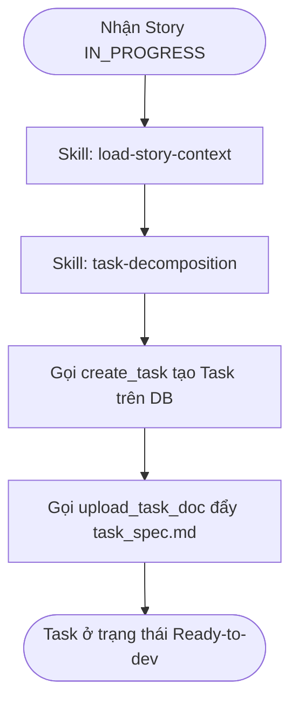

# Workflow: Decompose Story Tasks

## Description
Quy trình Tech Lead Bob phân rã User Story thành các Task kỹ thuật độc lập (gắn với từng Repository cụ thể), đăng ký các Task này lên cơ sở dữ liệu của hệ thống, và viết tài liệu đặc tả `task_spec.md` chi tiết để chuyển đổi trạng thái của các Task sang Ready-to-dev.

## Triggers
- Khi nhận được tín hiệu trigger từ hệ thống/User thông báo Story đã được PM duyệt sang trạng thái `IN_PROGRESS`.

## Mermaid Diagram

## Steps (Bảng Execution Steps Matrix)

| # | Bước thực hiện | Actor | Tool / Skill Mã hóa | Kết quả đầu ra |
|---|---|---|---|---|
| 1 | Tải đầy đủ context của Story | Bob | `[load-story-context](../skills/load-story-context/SKILL.md)` | Trích xuất và lưu trữ 6 tài liệu đặc tả cùng danh mục Repos và Stack của dự án vào bộ nhớ hoạt động. |
| 2 | Phân rã Task Story | Bob | `[task-decomposition](../skills/task-decomposition/SKILL.md)` | Gọi `create_task` tạo task trên hệ thống, upload tài liệu `task_spec.md` (gán repo cụ thể và chỉ định kỹ năng DEV bắt buộc) qua `upload_task_doc` để sẵn sàng cho DEV thực hiện. |

## Definition of Done
- [ ] Story đã được tải đầy đủ ngữ cảnh để làm cơ sở phân rã.
- [ ] Phân rã Story thành các task đơn nhiệm (1 Task = 1 Repository duy nhất trong danh mục `05-repositories-registry.md`).
- [ ] 100% Task kỹ thuật được đăng ký thành công trên DB hệ thống và có `taskKey` hợp lệ.
- [ ] 100% tài liệu đặc tả kỹ thuật `task_spec.md` được upload lên hệ thống tương ứng với từng Task, đảm bảo đầy đủ thông tin kỹ thuật để Task ở trạng thái **Ready-to-dev**.
