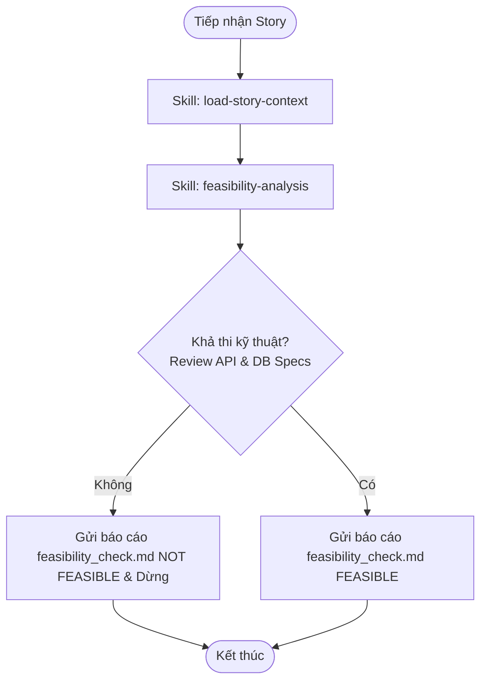

# Workflow: Review Story Feasibility

## Description
Quy trình Tech Lead Bob đánh giá tính khả thi kỹ thuật của User Story bằng cách tải đầy đủ ngữ cảnh và tiến hành review chi tiết đặc tả API (`api-spec.md`) và thiết kế cơ sở dữ liệu (`db_design.md`) do BA Lina viết, sau đó xuất và gửi báo cáo khả thi `feasibility_check.md` lên hệ thống.

## Triggers
- **Manual Command:** Người dùng ra lệnh với nội dung *"Hãy đánh giá tính khả thi kỹ thuật của [Mã hiệu story] đi"* hoặc các câu mang ý nghĩa tương tự.

## Mermaid Diagram

## Steps (Bảng Execution Steps Matrix)

| # | Bước thực hiện | Actor | Tool / Skill Mã hóa | Kết quả đầu ra                                                                                        |
|---|---|---|---|-------------------------------------------------------------------------------------------------------|
| 1 | Tải đầy đủ context của Story | Bob | `[load-story-context](../skills/load-story-context/SKILL.md)` | Trích xuất và lưu trữ 6 tài liệu đặc tả cùng metadata của Story và project/epic vào bộ nhớ hoạt động. |
| 2 | Đánh giá khả thi & review API/DB Specs | Bob | `[feasibility-analysis](../skills/feasibility-analysis/SKILL.md)` | Gửi báo cáo `feasibility_check.md` thành công lên hệ thống qua `report_feasibility_analysis`.                     |

## Definition of Done
- [ ] Story đã được tải đầy đủ context thông qua `load-story-context` mà không gặp lỗi thiếu tài liệu.
- [ ] Đã hoàn thành review chi tiết `api-spec.md` và `db_design.md` của Lina.
- [ ] Báo cáo khả thi `feasibility_check.md` (chứa rõ kết luận FEASIBLE / NOT FEASIBLE cùng đề xuất kỹ năng cho Dev) được upload thành công lên hệ thống.
