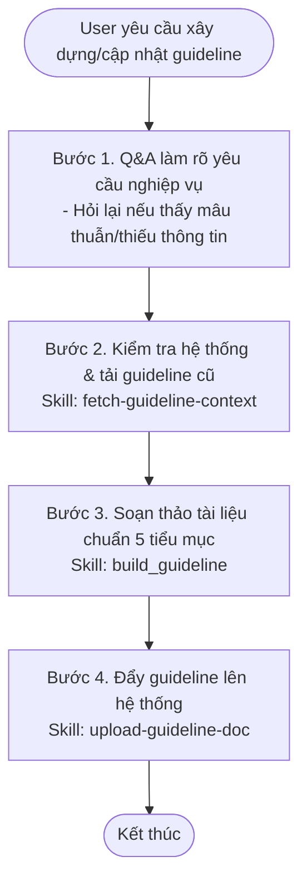

# Workflow: Xây dựng và Cập nhật Guideline Hệ Thống

## Description
Quy trình này hướng dẫn DooDoo thực hiện các bước tuần tự để tiếp nhận yêu cầu xây dựng guideline mới hoặc cập nhật guideline cũ, thực hiện phỏng vấn User (Q&A), tải và đối chiếu tài liệu cũ trên hệ thống, biên soạn guideline theo đúng chuẩn 5 tiểu mục đệ quy và đẩy lên server lưu trữ.

## Triggers
- **Manual Command:** Khi User yêu cầu: *"DooDoo, hãy xây dựng guideline cho [name]"* hoặc *"DooDoo, hãy cập nhật guideline cho [name] ở cấp độ [level]"*.

## Flow Diagram

## Execution Steps Matrix

| # | Bước (Action) | Actor | Tool/Skill mã hóa | Kết quả đầu ra (Output) |
|---|---|---|---|---|
| 1 | Q&A với User để làm rõ các yêu cầu nghiệp vụ cần viết guideline | DooDoo | Chờ phản hồi trực tiếp từ User trong chat. | Các thông tin nghiệp vụ/yêu cầu đã chốt (hỏi lại nếu thấy mâu thuẫn/thiếu thông tin) |
| 2 | Kiểm tra và tải nội dung guideline cũ (nếu có) từ server | DooDoo | [fetch-guideline-context](../skills/fetch-guideline-context/SKILL.md) | Nội dung `existing_guideline_content` làm bối cảnh đối chiếu |
| 3 | Thực hiện soạn thảo guideline theo chuẩn 5 tiểu mục đệ quy | DooDoo | [build_guideline](../skills/build_guideline/SKILL.md) | Nội dung Markdown `guideline_content` hoàn chỉnh |
| 4 | Đẩy guideline đã hoàn thành lên server hệ thống | DooDoo | [upload-guideline-doc](../skills/local-mcp/upload-guideline-doc/SKILL.md) | Tài liệu guideline được lưu trữ thành công trên server |

## Definition of Done (DoD)
* [ ] Đã làm rõ mọi yêu cầu nghiệp vụ với User thông qua Q&A (không còn mâu thuẫn hay thiếu dữ kiện).
* [ ] Đã tải thành công tài liệu guideline cũ (nếu có) thông qua skill `fetch-guideline-context`.
* [ ] Tài liệu guideline mới được viết tuân thủ 100% chuẩn đệ quy: mọi đầu mục chính bắt buộc có đủ 5 tiểu mục chuẩn (Mô tả, Cách viết, Nguồn, Thu thập, Template).
* [ ] Đã gọi thành công MCP tool `upload_guideline_doc` để đồng bộ guideline lên hệ thống.
