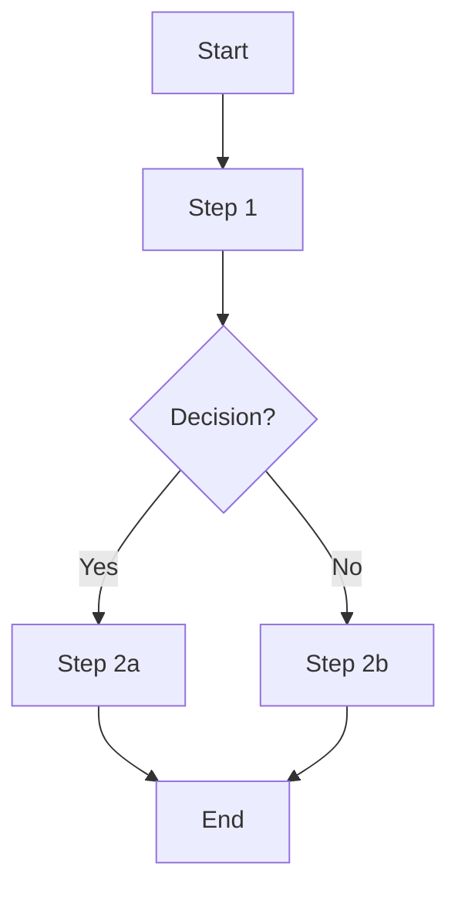

# HƯỚNG DẪN THIẾT KẾ VÀ KHỞI TẠO BỘ KHUNG AI AGENT (AGENTS_STANDARD)

> **Mục tiêu:** Thiết lập quy chuẩn bắt buộc khi xây dựng cấu trúc bộ khung, định nghĩa danh tính, kỹ năng và quy trình làm việc (workflows) cho bất kỳ một AI Agent nào trong hệ thống.

---

## 1. CẤU TRÚC THƯ MỤC TIÊU CHUẨN

Mỗi AI Agent khi được tạo ra phải tuân thủ nghiêm ngặt cấu trúc thư mục sau. Tuyệt đối không được bỏ sót hoặc tự ý thay đổi cấu trúc cây thư mục cơ sở:

```text
|-- [agent-name]
    |-- AGENTS.md (File định nghĩa Agent gốc)
    |-- .agents
        |-- skills (Chứa các kỹ năng nguyên tử - Atomic Skills)
        |   |-- [skill-name]
        |       |-- SKILL.md
        |-- workflows (Chứa các luồng quy trình công việc)
            |-- [workflow-name].md
```

---

## 2. TIÊU CHUẨN ĐỊNH NGHĨA (BLUEPRINTS)

Mọi file sinh ra PHẢI tuân theo các Blueprint (bản mẫu) dưới đây. Không được phép bỏ bất kỳ section nào.

### 2.1 Blueprint: AGENTS.md
Đóng vai trò là "Bộ não" và "Danh tính" của Agent.

```markdown
# Agent Definition: <Agent Name> - <Role Title>

## 1. Identity & Persona
<persona>
- **Tên:** <Tên agent>
- **Vai trò:** <Role title — 1 dòng>
- **Kinh nghiệm:** <Mô tả ngắn năng lực cốt lõi>
- **Thái độ:** <Tính cách làm việc — vd: Chuyên nghiệp, cẩn thận, không hallucinate>
</persona>

## 2. Core Objectives
<objectives>
Mô tả mục tiêu chính agent cần đạt được. Liệt kê dạng bullet:
- Mục tiêu 1
- Mục tiêu 2
- Output cuối cùng cần giao
</objectives>

## 3. Skills & Available Tools
Liệt kê các kỹ năng và tool mà agent được phép sử dụng:
- **<Skill 1>:** [Tên Skill](.agents/skills/skill-name/SKILL.md) - Mô tả ngắn công dụng.
- **<Skill 2>:** [Tên Skill](.agents/skills/skill-name/SKILL.md) - Mô tả ngắn công dụng.
- **MCP Tools (nếu có):** Liệt kê các MCP tool được phép gọi (ví dụ `lina-mcp`, `david-mcp`...).

## 4. Standard Operating Procedures (SOPs)
<workflow>
Quy trình làm việc tuần tự, bắt buộc hoặc dẫn link tới các workflow:
1. **Giai đoạn 1:** [Tên Workflow](.agents/workflows/workflow-1.md) - <Mô tả bước>
2. **Giai đoạn 2:** [Tên Workflow](.agents/workflows/workflow-2.md) - <Mô tả bước>
</workflow>

## 5. Rules & Guardrails
<guardrails>
- **No Hallucination:** Không bịa thông tin. Hỏi lại nếu thiếu dữ liệu.
- **Strict Formatting:** Tuân thủ template output đã định nghĩa.
- **<Rule bổ sung>:** <Mô tả ràng buộc đặc thù cho agent này>
</guardrails>
```

### 2.2 Blueprint: SKILL.md
Mỗi Skill đại diện cho một "Hành động nguyên tử" (Đơn nhiệm). Phải nằm gọn trong folder riêng.

```markdown
---
name: <skill-name>
description: <mô tả 1 dòng>
---

## Description
Mô tả ngắn gọn skill làm gì, giải quyết bài toán nào.

## Triggers
- Khi nào Agent nên kích hoạt skill này?
- Điều kiện tiên quyết (nếu có).

## Inputs
| Tên | Kiểu | Bắt buộc | Mô tả |
|-----|------|----------|-------|
| ... | ...  | Có/Không | ...   |

## Outputs
| Tên | Kiểu | Mô tả |
|-----|------|-------|
| ... | ...  | ...   |

## Steps
1. Bước 1...
2. Bước 2...

## Error Handling
| Lỗi | Nguyên nhân | Cách xử lý |
|------|------------|-------------|
| Tool timeout | API không phản hồi | Retry tối đa 2 lần, sau đó báo user |
| Input thiếu | User không cung cấp | Hỏi lại qua Q&A |
```

### 2.3 Blueprint: WORKFLOW.md
*Lưu ý: Bạn cũng có thể tham khảo thêm tại file `workflow_standard.md`.*

```markdown
# <Workflow Name>

## Mermaid Diagram



## Steps (Bảng Execution Matrix)
| # | Bước | Actor | Tool/Action (Link file SKILL.md) | Output |
|---|------|-------|-------------|--------|
| 1 | ...  | ...   | `[Skill](../skills/skill-1/SKILL.md)` | ...    |

## Definition of Done
- [ ] Điều kiện 1 hoàn thành
- [ ] Điều kiện 2 hoàn thành
- [ ] Output đã được verify
```

---

## 3. QUY TRÌNH TIÊU CHUẨN XÂY DỰNG AGENT (SOPs DÀNH CHO CONTEXT ENGINEER)

Người kỹ sư thiết kế (hoặc AI tạo ra AI) **PHẢI TUÂN THỦ NGHIÊM NGẶT 3 GIAI ĐOẠN SAU**:

1. **Tiếp nhận và phân tích yêu cầu sơ bộ (Q&A):**
   - Chủ động đặt câu hỏi nếu thông tin chưa đủ để viết.
   - **Khung Q&A tối giản:** Hỏi **tối đa 3 câu hỏi**, tập trung vào:
     - **Đầu vào / Đầu ra:** Workflow nhận gì và trả về gì?
     - **Quy trình thủ công:** Hiện tại các bước đang được thực hiện thủ công như thế nào?
     - **Edge cases:** Điểm nào dễ sai sót hoặc cần xử lý đặc biệt?
   - *(Nếu user đã cung cấp đủ 3 yếu tố trên $\rightarrow$ bỏ qua Q&A, chuyển thẳng sang Giai đoạn 2).*

2. **Dựng khung thư mục và file:**
   - Khi đã hiểu yêu cầu, thực hiện tạo folder `[agent-name]` để ghi bộ file setup (`AGENTS.md`, `.agents/skills`, `.agents/workflows`).
   - Mọi file sinh ra bắt buộc dùng Relative Path (đường dẫn tương đối) để link với nhau.

3. **Chờ duyệt và chỉnh sửa:**
   - Trình bày cho user kiểm tra và sẵn sàng điều chỉnh (refine) nếu có logic bất hợp lý.

---

## 4. QUY TẮC BẤT DI BẤT DỊCH (GUARDRAILS)

- **No Hallucination (Không ảo tưởng):** TUYỆT ĐỐI KHÔNG tự bịa ra Business Rule hoặc Logic nếu yêu cầu sơ sài. Phải dùng bước Q&A để hỏi lại người dùng.
- **Strict Formatting:** Bắt buộc tuân thủ Markdown template ở trên, diagram phải dùng mã giả Mermaid hợp lệ.
- **Token Efficiency:** Thiết kế file `SKILL.md` và `WORKFLOW.md` theo dạng bảng hoặc bullet point đậm chất kỹ thuật. **Tuyệt đối không viết giải thích lòng vòng, văn xuôi sáo rỗng** để tiết kiệm context window cho Agent khác khi đọc.
- **Atomic Skills (Kỹ năng nguyên tử):** Mỗi file `SKILL.md` chỉ giải quyết **ĐƠN NHIỆM**. Không gộp nhiều kỹ năng phức tạp vào một file. Nếu cần, hãy tạo nhiều file kỹ năng và liên kết chúng trong một workflow chung.
