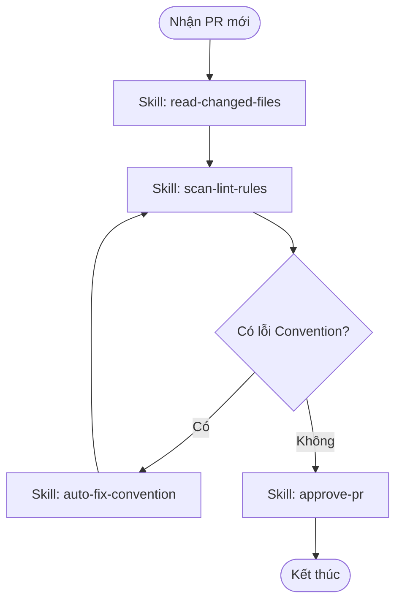

# HƯỚNG DẪN THIẾT KẾ VÀ VIẾT WORKFLOW CHO AI AGENT

> **Mục tiêu:** Biến một luồng công việc phức tạp thành các bước chạy tuần tự, có rẽ nhánh, có kiểm định dữ liệu và tự động sửa lỗi (Self-healing).

---

## BƯỚC 1: Thu Thập & Phân Tích Thông Tin Khung

Trước khi đặt bút viết, bạn phải làm rõ 3 câu hỏi cốt lõi sau để tránh lỗi ảo tưởng (Hallucination):

1. **Trigger & Data Boundaries:** Cái gì kích hoạt quy trình này? Đầu vào gồm những file/biến nào? Đầu ra mong muốn chính xác là gì?
2. **Atomic Breakdown:** Quy trình này có thể chia nhỏ thành các tác vụ đơn nhiệm (Single-task) nào? (Mỗi tác vụ tương ứng với 1 SKILL).
3. **The Happy Path & Edge Cases:** Luồng chạy lý tưởng là gì? Nếu một bước bị lỗi (ví dụ: test fail, build fail), Agent sẽ phải quay lại bước nào để sửa?

---

## BƯỚC 2: Cấu Trúc Chi Tiết Của File WORKFLOW.md

Mọi file Workflow bắt buộc phải tuân theo cấu trúc 6 phần nghiêm ngặt sau:

### 1. Tên Workflow
Đặt tên file dạng snake-case hoặc kebab-case (ví dụ: auto-code-review.md). Đầu file dùng thẻ `# Workflow: <Tên Workflow>` kèm mô tả ngắn gọn.

### 2. Mô tả (Description)
Thẻ `## Description`. Dành 1-2 câu giải thích rõ quy trình này sinh ra để giải quyết bài toán gì, ai sẽ là người thực thi chính.

### 3. Kích hoạt (Triggers)
Thẻ `## Triggers`. Liệt kê các điều kiện, sự kiện hoặc các câu lệnh (Manual Command) khiến Agent bắt đầu chạy luồng công việc này.

### 4. Thiết Kế Luồng Bằng Biểu Đồ Mermaid (BẮT BUỘC)

AI Agent đọc hiểu sơ đồ đồ họa cực tốt. Sơ đồ phải thể hiện rõ: **Điểm bắt đầu, Các bước xử lý, Nút quyết định (Decision Node), Luồng xử lý lỗi (Error Loop), và Điểm kết thúc.**

> **Quy tắc vẽ Mermaid:**
> * Khối điều kiện dùng hình thoi {Tình huống?}.
> * Phải có mũi tên quay ngược lại (Loop) nếu kiểm tra chất lượng không đạt.
>
>

### 5. Ma Trận Thực Thi Các Bước (Execution Steps Matrix)

Trình bày các bước dưới dạng **Bảng (Table)** để tối ưu hóa Token và giúp Agent quét thông tin (scan) nhanh nhất.

| # | Bước (Action) | Actor (Ai làm?) | Tool/Skill mã hóa | Kết quả đầu ra (Output) |
| --- | --- | --- | --- | --- |
| 1 | Quét các file thay đổi trong Pull Request | Agent | [.agents/skills/git/read-changed-files.md] | Danh sách file kèm diff code |
| 2 | Kiểm tra cú pháp và coding convention | Agent | [.agents/skills/linter/scan-lint-rules.md] | File log báo cáo lỗi (nếu có) |
| 3 | Tự động sửa lỗi convention cơ bản | Agent | [.agents/skills/linter/auto-fix-convention.md] | Code đã được format lại |
| 4 | Duyệt và viết nhận xét lên Pull Request | Agent | [.agents/skills/git/approve-pr.md] | Trạng thái Approved trên GitHub |

> ⚠️ **Lưu ý tối quan trọng:** Tại cột Tool/Skill mã hóa, bắt buộc phải link chính xác đến file định nghĩa Skill tương ứng bằng Relative Path.

### 6. Tiêu Chuẩn Hoàn Thành (Definition of Done - DoD)

Định nghĩa rõ các Checklist để Agent tự nghiệm thu công việc trước khi dừng workflow. Tránh tình trạng Agent "bỏ con giữa chợ" khi task chưa hoàn thành triệt để.

* [ ] Toàn bộ code thay đổi đã được linter quét qua.
* [ ] Không còn lỗi convention nghiêm trọng nào tồn đọng.
* [ ] Bot đã để lại comment giải thích rõ ràng tại những dòng code bị sửa.
* [ ] Trạng thái Pull Request được chuyển dịch thành công (Approve hoặc Request Changes).

---

## BƯỚC 3: Bộ Quy Tắc Vàng (Guardrails) Khi Viết Workflow

* **Nguyên tắc Đơn nhiệm (KISS - Keep It Simple, Stupid):** Workflow không tự thực thi trực tiếp logic, nó chỉ "gọi tên" các Skill. Nếu một bước quá phức tạp, hãy tách nó thành một Skill độc lập.
* **Human-in-the-loop (Con người can thiệp):** Với các workflow nhạy cảm (như Deploy Production, Merge Code Main), bắt buộc phải có một bước: **"Gửi yêu cầu phê duyệt $\rightarrow$ Chờ User phản hồi Yes/No"** trước khi đi tiếp.
* **Tuyệt đối không viết văn xuôi:** Loại bỏ hoàn toàn các câu từ hoa mỹ, giải thích dông dài. Sử dụng ký hiệu, bảng biểu và gạch đầu dòng kỹ thuật.

---
