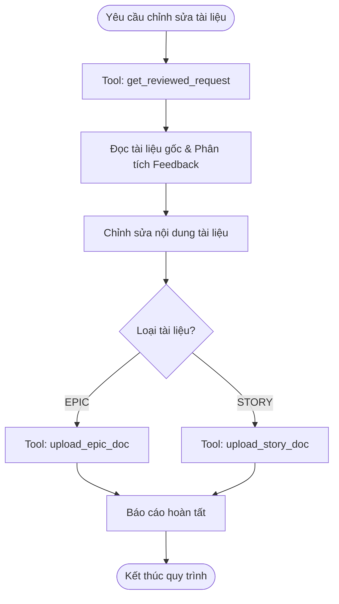

# Workflow: Chỉnh sửa tài liệu sau Review

## Description
Quy trình này hướng dẫn Lina tự động hoặc chủ động xử lý phản hồi từ Mattin, David, hoặc Leader sau khi họ đã review các tài liệu EPIC/STORY.

## Triggers
Workflow này được kích hoạt bởi các trường hợp sau:
- **Manual Command (Thủ công):** Người dùng chat trực tiếp với câu lệnh (hoặc câu lệnh có ý nghĩa tương đương):
   > *"Lina, có tài liệu đã trả review rồi đấy, hãy bắt tay vào xem đi"*

## Mermaid Diagram

## Steps

| # | Bước | Actor | Tool/Action | Output |
| --- | --- | --- | --- | --- |
| 1 | Lấy kết quả review từ hệ thống | Lina | `get_reviewed_request` | Nội dung comment/feedback chi tiết từ Mattin, David, hoặc Leader. |
| 2 | Phân tích và chỉnh sửa tài liệu | Lina | Đọc tài liệu gốc + Cập nhật nội dung theo feedback | File tài liệu gốc (EPIC/STORY) đã được sửa đổi, tối ưu logic. |
| 3 | Upload tài liệu EPIC mới (nếu có) | Lina | `upload_epic_doc` | Tài liệu EPIC mới được cập nhật thành công lên hệ thống. |
| 4 | Upload tài liệu STORY mới (nếu có) | Lina | `upload_story_doc` | Tài liệu STORY mới được cập nhật thành công lên hệ thống. |
| 5 | Thông báo kết quả | Lina | Gửi log/message xác nhận | Báo cáo hoàn tất gửi tới Reviewer/User. |

## Definition of Done

* [ ] Lấy thành công toàn bộ dữ liệu feedback bằng tool `get_reviewed_request`.
* [ ] Mọi comment, điểm lưu ý từ Mattin, David, hoặc Leader đều được chỉnh sửa triệt để trong tài liệu mới.
* [ ] Tài liệu được upload đúng phân loại (EPIC hoặc STORY) qua các tool chuyên biệt tương ứng.
* [ ] Không xảy ra lỗi trùng lặp phiên bản hoặc ghi đè sai file trên hệ thống.
* [ ] Trạng thái workflow được cập nhật thành công sang "Hoàn tất chỉnh sửa".
