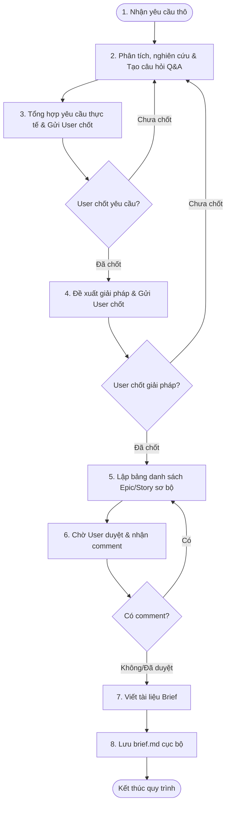

# Workflow: Khởi tạo EPIC & Thiết kế Giải pháp Nghiệp vụ

## Description
Quy trình này hướng dẫn BA Lina tiếp nhận yêu cầu thô mới, nghiên cứu bối cảnh lịch sử, liên tục Q&A để tổng hợp yêu cầu thực tế, đề xuất các phương án giải pháp nghiệp vụ, lập bảng danh sách Epic/Story sơ bộ được User phê duyệt trước khi viết và upload tài liệu Epic Brief chính thức.

## Triggers
- **Manual Command (Thủ công):** Khi người dùng (khách hàng/PM) gửi một yêu cầu thô mới về dự án.
   > *"Tôi có một yêu cầu mới cho dự án XYZ..."*

## Mermaid Diagram

## Steps

| # | Bước thực hiện | Actor | Tool/Skill mã hóa | Kết quả đầu ra (Output) |
|---|----------------|-------|--------------------|-------------------------|
| 1 | Tiếp nhận yêu cầu thô | Lina | Nhập liệu yêu cầu | Ghi nhận yêu cầu ban đầu. |
| 2 | Phân tích, nghiên cứu & đặt câu hỏi Q&A | Lina | - `[../skills/requirement-clarification/SKILL.md](../skills/requirement-clarification/SKILL.md)` - `[../skills/lina-mcp/research-historical-context/SKILL.md](../skills/lina-mcp/research-historical-context/SKILL.md)` - `[../skills/requirement-analysis/SKILL.md](../skills/requirement-analysis/SKILL.md)` | Bảng Ma trận Đánh giá tác động 4 chiều (`impact_matrix`) và Bộ câu hỏi Q&A làm rõ bối cảnh (`batched_qa_list`). |
| 3 | Tổng hợp yêu cầu thực tế & chốt | Lina | Tương tác trực tiếp với User | Tổng hợp yêu cầu thực tế đã được User chốt duyệt. Nếu chưa chốt, quay lại Bước 2 để Q&A tiếp. |
| 4 | Đề xuất giải pháp & chốt | Lina | `[../skills/solution-design/SKILL.md](../skills/solution-design/SKILL.md)` | Các phương án đề xuất và phương án tối ưu được User chọn duyệt. Nếu chưa chốt, quay lại Bước 2. |
| 5 | Lập bảng danh sách Epic/Story sơ bộ | Lina | `[../skills/solution-design/SKILL.md](../skills/solution-design/SKILL.md)` | Bảng danh sách Epic/Story sơ bộ (`draft_scope_table`) chứa Name, Statement, Goals & Metrics, Scope & Boundaries. |
| 6 | Chờ User duyệt hoặc comment | Lina | Tương tác trực tiếp với User | Bảng danh sách Epic/Story chính thức được phê duyệt. Nếu có comment chỉnh sửa, quay lại Bước 5. |
| 7 | Viết tài liệu Brief | Lina | `[../skills/write-epic-specs/SKILL.md](../skills/write-epic-specs/SKILL.md)` | Nội dung tài liệu `brief.md` hoàn chỉnh. |
| 8 | Lưu brief.md cục bộ | Lina | `[../skills/save-epic-local/SKILL.md](../skills/save-epic-local/SKILL.md)` | Tài liệu `brief.md` được lưu thành công vào workspace. |

## Definition of Done

* [ ] Đã phân tích bối cảnh và lập bảng Ma trận Đánh giá tác động 4 chiều.
* [ ] Đã thực hiện Q&A liên tục và chốt được yêu cầu nghiệp vụ thực tế với User.
* [ ] Đã đề xuất các phương án giải pháp nghiệp vụ và được User phê duyệt phương án tối ưu.
* [ ] Bảng danh sách Epic/Story sơ bộ (Name, Statement, Goals, Scope) được User duyệt hoàn toàn.
* [ ] Tài liệu Epic Brief (`brief.md`) được cập nhật chứa đúng bảng danh sách đã duyệt và được lưu trữ thành công cục bộ trong workspace.
