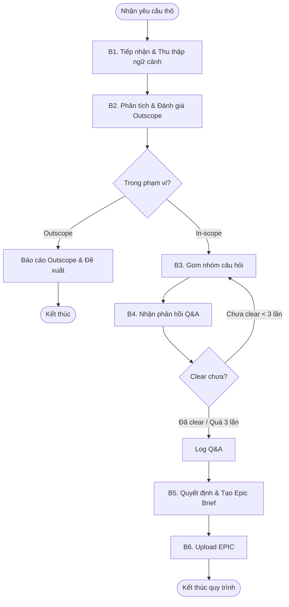

# Workflow: Khởi tạo EPIC chờ duyệt

## Description
Quy trình này hướng dẫn Lina làm rõ yêu cầu thô, thu thập ngữ cảnh kỹ thuật (DB/API), lọc bỏ các yêu cầu Outscope, thực hiện vòng lặp Q&A và tạo/cập nhật các EPIC trên hệ thống.

## Triggers
- **Manual Command (Thủ công):** Khi người dùng (khách hàng/PM) gửi một yêu cầu thô về dự án.
   > *"Tôi có một yêu cầu mới cho dự án XYZ..."*

## Mermaid Diagram

## Steps

| # | Bước | Actor | Tool/Action                                                                                                                               | Output                                                                                                              |
|---|------|-------|-------------------------------------------------------------------------------------------------------------------------------------------|---------------------------------------------------------------------------------------------------------------------|
| 1 | Tiếp nhận & Thu thập ngữ cảnh | Lina | Gọi liên hoàn các kỹ năng: `[../skills/lina-mcp/research-project-overview/SKILL.md](../skills/lina-mcp/research-project-overview/SKILL.md)` $\rightarrow$ `[../skills/lina-mcp/research-historical-context/SKILL.md](../skills/lina-mcp/research-historical-context/SKILL.md)` $\rightarrow$ `[../skills/lina-mcp/research-db-spec/SKILL.md](../skills/lina-mcp/research-db-spec/SKILL.md)` $\rightarrow$ `[../skills/lina-mcp/research-api-spec/SKILL.md](../skills/lina-mcp/research-api-spec/SKILL.md)` | Ngữ cảnh toàn diện về hệ thống, DB, API.                                                                            |
| 2 | Phân tích & Đánh giá Outscope | Lina | `[../skills/requirement-clarification/SKILL.md](../skills/requirement-clarification/SKILL.md)`                                            | Khung phân tích 5W1H & Edge Cases. Nếu tính năng nằm ngoài phạm vi $\rightarrow$ Chuyển tới báo cáo Outscope và dừng. |
| 3 | Gom nhóm câu hỏi | Lina | `[../skills/requirement-analysis/SKILL.md](../skills/requirement-analysis/SKILL.md)`                                                      | Danh sách câu hỏi tổng hợp. Bắt buộc: Nếu là vòng lặp lại, phải sinh câu hỏi mới, tuyệt đối không lặp lại câu cũ.   |
| 4 | Xử lý & Log câu trả lời | Lina | Nhận phản hồi người dùng. Nếu chưa rõ $\rightarrow$ Quay lại B3 (Max 3 lần). Khi clear $\rightarrow$ Gọi `[../skills/lina-mcp/log-qna/SKILL.md](../skills/lina-mcp/log-qna/SKILL.md)`.                       | Log thông tin Q&A trên hệ thống.                                                                                    |
| 5 | Tạo/Cập nhật Epic Brief | Lina | `[../skills/write-epic-specs/SKILL.md](../skills/write-epic-specs/SKILL.md)`                                                              | Tài liệu Epic Brief hoàn chỉnh (quyết định tạo mới hay cập nhật dựa trên kết quả rà soát ở B1).                     |
| 6 | Upload EPIC | Lina | Gọi `[../skills/lina-mcp/upload-epic-doc/SKILL.md](../skills/lina-mcp/upload-epic-doc/SKILL.md)`                                                                                                                     | Tài liệu EPIC được đẩy lên hệ thống.                                                                                |

## Definition of Done

* [ ] Đã thu thập đủ ngữ cảnh thông qua các kỹ năng tổ hợp (Project Overview, Historical Context, DB/API Spec).
* [ ] Yêu cầu thô đã được đánh giá kỹ lưỡng In-scope/Outscope trước khi đem đi Q&A.
* [ ] Nếu In-scope, yêu cầu được làm rõ với tối đa 3 vòng lặp Q&A không trùng lặp câu hỏi.
* [ ] Nội dung làm rõ đã được lưu thông qua kỹ năng `log-qna`.
* [ ] File `brief.md` được tạo đúng định dạng và nội dung.
* [ ] Tài liệu EPIC đã được upload thành công lên hệ thống thông qua kỹ năng `upload-epic-doc`.
