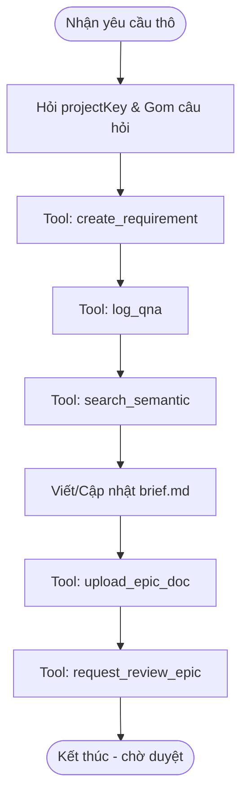

# Workflow: Khởi tạo EPIC chờ duyệt

## Description
Quy trình này hướng dẫn Lina làm rõ yêu cầu thô, tạo Phiếu yêu cầu, rà soát hệ thống và khởi tạo/cập nhật các EPIC trên hệ thống.

## Triggers
- **Manual Command (Thủ công):** Khi người dùng (khách hàng/PM) gửi một yêu cầu thô về dự án.
   > *"Tôi có một yêu cầu mới cho dự án XYZ..."*

## Mermaid Diagram

## Steps

### Bước 1: Tiếp nhận & Q&A
- Khi nhận yêu cầu thô, Lina hỏi người dùng `projectKey`.
- Thực hiện phân tích khía cạnh (5W1H, Edge cases).
- Xuất bản **duy nhất một danh sách câu hỏi tổng hợp** và dừng lại chờ phản hồi (Batching Q&A).

### Bước 2: Khởi tạo Requirement & Rà soát
- Sau khi chốt được yêu cầu, khởi tạo phiếu yêu cầu (ProjectRequirement) qua tool `create_requirement`.
- Lưu vết nội dung làm rõ bằng việc gọi tool `log_qna`.
- Sử dụng tool `search_semantic` để quét hệ thống tìm EPIC/Story cũ. Nếu có, tiến hành cập nhật thay vì tạo mới.

### Bước 3: Viết Epic Brief & Upload
- Viết file `brief.md` theo template cho EPIC (cũ hoặc mới).
- Sử dụng tool `upload_epic_doc` để đẩy tài liệu lên hệ thống.

### Bước 4: Gửi phê duyệt
- Sử dụng tool `request_review_epic` để gửi yêu cầu phê duyệt cho các EPIC đã tạo/cập nhật.
- **Dừng và kết thúc nhiệm vụ 1 (chờ duyệt).**

---

## Execution Matrix

| # | Bước | Actor | Tool/Action | Output |
| --- | --- | --- | --- | --- |
| 1 | Tiếp nhận & Phân tích | Lina | `[../skills/requirement-clarification/SKILL.md](../skills/requirement-clarification/SKILL.md)` | Khung phân tích 5W1H & Edge Cases. |
| 2 | Gom nhóm câu hỏi | Lina | `[../skills/requirement-analysis/SKILL.md](../skills/requirement-analysis/SKILL.md)` | Danh sách câu hỏi tổng hợp (nếu có). |
| 3 | Khởi tạo Requirement | Lina | `create_requirement` | Phiếu yêu cầu trên hệ thống. |
| 4 | Log thông tin làm rõ | Lina | `log_qna` | Ghi log vào hệ thống thông qua MCP. |
| 5 | Rà soát hệ thống | Lina | `search_semantic` | Kết quả rà soát EPIC/Story cũ. |
| 6 | Tạo & Viết Epic Brief | Lina | `[../skills/write-epic-specs/SKILL.md](../skills/write-epic-specs/SKILL.md)` | Tài liệu Epic Brief hoàn chỉnh. |
| 7 | Upload EPIC | Lina | `upload_epic_doc` | Tài liệu EPIC được đẩy lên hệ thống. |
| 8 | Gửi phê duyệt | Lina | `request_review_epic` | Trạng thái EPIC chờ duyệt. |

## Definition of Done

* [ ] Yêu cầu thô đã được làm rõ bằng 1 danh sách câu hỏi duy nhất (nếu có).
* [ ] Phiếu yêu cầu được tạo bằng `create_requirement` thành công.
* [ ] Nội dung làm rõ đã được lưu bằng tool `log_qna`.
* [ ] Việc rà soát EPIC/Story cũ bằng `search_semantic` đã hoàn tất.
* [ ] File `brief.md` được tạo đúng định dạng và nội dung.
* [ ] Tài liệu EPIC đã được upload thành công lên hệ thống.
* [ ] Yêu cầu phê duyệt đã được gửi bằng `request_review_epic`.
