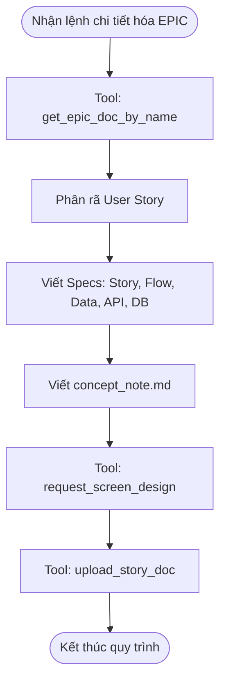

# Workflow: Chi tiết hóa EPIC

## Description
Quy trình này hướng dẫn Lina truy xuất một EPIC đã được duyệt từ hệ thống và triển khai chi tiết các bộ Spec cho các User Story.

## Triggers
- **Manual Command (Thủ công):** Hệ thống hoặc PM thông báo một EPIC đã được duyệt và yêu cầu Lina chi tiết hóa.
   > *"EPIC-123 đã được duyệt, hãy tiến hành phân rã và chi tiết hóa Specs."*

## Mermaid Diagram

## Steps

| # | Bước | Actor | Tool/Action | Output |
| --- | --- | --- | --- | --- |
| 1 | Truy xuất tài liệu Epic | Lina | `get_epic_doc_by_name` | Nội dung tài liệu EPIC đã được duyệt. |
| 2 | Phân rã Story & Viết Specs | Lina | `[../skills/write-story-specs/SKILL.md](../skills/write-story-specs/SKILL.md)` | Các file: `user-story`, `concept_note`, `user-flow`, `data-dictionary`, `api-spec`, `db_design`. |
| 4 | Phối hợp UI/UX | Lina | `request_screen_design` | Gửi yêu cầu thiết kế cho Robin. |
| 5 | Upload Specs | Lina | `upload_story_doc` | Các tài liệu Spec được đẩy lên hệ thống. |

## Definition of Done

* [ ] Đã kéo thành công tài liệu EPIC bằng tool tương ứng.
* [ ] User Story được phân rã hợp lý từ EPIC.
* [ ] Đã hoàn thiện đủ 6 file Spec (`user-story`, `concept_note`, `user-flow`, `data-dictionary`, `api-spec`, `db_design`).
* [ ] Yêu cầu thiết kế đã được gửi tới Robin thông qua `request_screen_design`.
* [ ] Toàn bộ các file Spec đã được upload thành công lên hệ thống qua các tool upload chuyên biệt.
