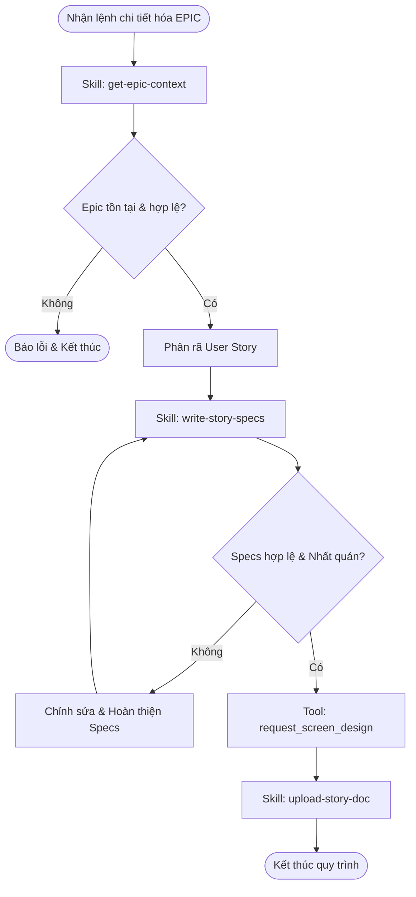

# Workflow: Chi tiết hóa EPIC

## Description
Quy trình này hướng dẫn Lina truy xuất một EPIC đã được duyệt từ hệ thống và triển khai chi tiết các bộ Spec cho các User Story.

## Triggers
- **Manual Command (Thủ công):** Hệ thống hoặc PM thông báo một EPIC đã được duyệt và yêu cầu Lina chi tiết hóa.
   > *"EPIC-123 đã được duyệt, hãy tiến hành phân rã và chi tiết hóa Specs."*

## Mermaid Diagram

## Steps

| # | Bước                              | Actor | Tool/Skill mã hóa                                                                                | Kết quả đầu ra (Output)                                                                          |
|---|-----------------------------------| ----- |--------------------------------------------------------------------------------------------------|--------------------------------------------------------------------------------------------------|
| 1 | Truy xuất tài liệu Epic           | Lina  | `[../skills/lina-mcp/get-epic-context/SKILL.md](../skills/lina-mcp/get-epic-context/SKILL.md)`   | Bối cảnh Epic (epicTitle, storyList, epicDocuments, epicContext).                                |
| 2 | Phân rã Story & Viết Specs        | Lina  | `[../skills/write-story-specs/SKILL.md](../skills/write-story-specs/SKILL.md)`                   | Các file Spec: `user-story`, `concept_note`, `user-flow`, `data-dictionary`, `api-spec`, `db_design`. |
| 3 | Phối hợp UI/UX                    | Lina  | `request_screen_design` (MCP Tool)                                                               | Gửi yêu cầu thiết kế màn hình thành công cho Robin.                                             |
| 4 | Upload Specs                      | Lina  | `[../skills/lina-mcp/upload-story-doc/SKILL.md](../skills/lina-mcp/upload-story-doc/SKILL.md)`   | Các tài liệu Spec được đẩy lên hệ thống lưu trữ tập trung.                                       |

## Definition of Done

* [ ] Đã kéo thành công bối cảnh EPIC bằng skill `get-epic-context`.
* [ ] Danh sách User Story được phân rã hợp lý từ bối cảnh EPIC đã lấy.
* [ ] Đã hoàn thiện đủ 6 file Spec (`user-story`, `concept_note`, `user-flow`, `data-dictionary`, `api-spec`, `db_design`) với dữ liệu đồng bộ và nhất quán.
* [ ] Yêu cầu thiết kế màn hình đã được gửi tới Robin thành công thông qua `request_screen_design`.
* [ ] Toàn bộ các file Spec của Story đã được upload thành công lên hệ thống thông qua skill `upload-story-doc`.
