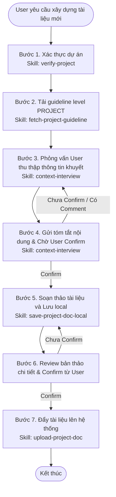

# Workflow: Xây dựng tài liệu cấp dự án cho dự án mới

## Description
Quy trình này hướng dẫn Lux cách tiếp nhận yêu cầu xây dựng một tài liệu cấp dự án mới, xác thực sự tồn tại của dự án, tải guideline mẫu, phỏng vấn chốt tóm tắt nội dung với User, biên soạn và lưu cục bộ, và cuối cùng đẩy tài liệu lên hệ thống.

## Triggers
- **Manual Command:** Khi User yêu cầu: *"Lux, hãy xây dựng tài liệu [A] cho dự án [X]"* (Ví dụ: *"Lux, hãy xây dựng tài liệu 01-overview.md cho dự án ECOM"*).

## Flow Diagram

## Execution Steps Matrix

| # | Bước (Action) | Actor | Tool/Skill mã hóa | Kết quả đầu ra (Output) |
|---|---|---|---|---|
| 1 | Xác thực xem dự án X có tồn tại trên hệ thống hay không | Lux | [verify-project](../skills/local-mcp/verify-project/SKILL.md) | Biến `is_valid` = `true` (nếu không có thì dừng báo lỗi) |
| 2 | Lấy guideline mẫu chuẩn cấp PROJECT của tài liệu A | Lux | [fetch-project-guideline](../skills/local-mcp/fetch-project-guideline/SKILL.md) | Nội dung `guideline_content` làm barem cấu trúc |
| 3 | Lập câu hỏi phỏng vấn tối giản gửi User để lấy thông tin khuyết | Lux | [context-interview](../skills/context-interview/SKILL.md) | Phản hồi giải đáp nghiệp vụ và bối cảnh kỹ thuật |
| 4 | Tổng hợp tóm tắt nội dung chuẩn bị viết và gửi User confirm | Lux | [context-interview](../skills/context-interview/SKILL.md) | Bản tóm tắt đã được User đồng ý (confirm) |
| 5 | Soạn thảo tài liệu chuẩn Markdown và lưu cục bộ | Lux | [save-project-doc-local](../skills/save-project-doc-local/SKILL.md) | Tài liệu được lưu tại `{projectKey}/{name}` |
| 6 | Đẩy tài liệu hoàn thiện lên server hệ thống | Lux | [upload-project-doc](../skills/local-mcp/upload-project-doc/SKILL.md) | Xác nhận upload tài liệu thành công |

## Definition of Done (DoD)
* [ ] Dự án X đã được xác thực thành công qua tool `projects_list`.
* [ ] Đã tải thành công guideline mẫu `guideline://PROJECT/[name]`.
* [ ] Bộ câu hỏi phỏng vấn tối giản (< 5 câu) được gửi và trả lời hoàn tất.
* [ ] Bản tóm tắt nội dung tài liệu được gửi và **User confirm đồng ý** trước khi viết.
* [ ] File tài liệu Markdown hoàn chỉnh được ghi cục bộ thành công tại `{projectKey}/{name}`.
* [ ] Bản thảo đầy đủ được User review và confirm đồng ý.
* [ ] Đã gọi MCP tool `upload_project_doc` thành công để đồng bộ tài liệu lên server.
