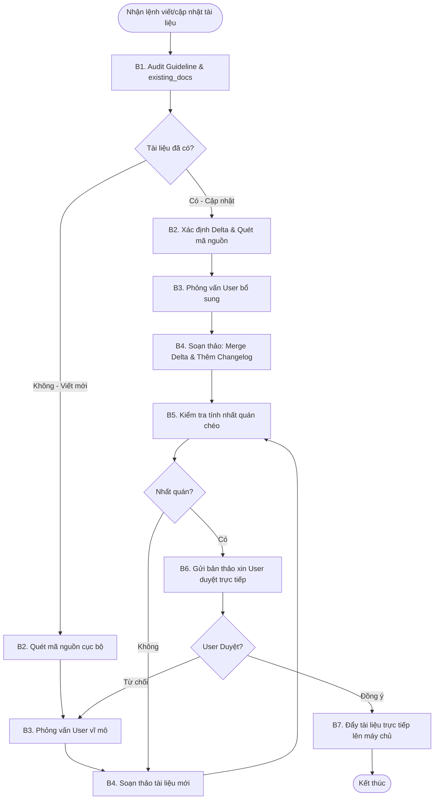

# Workflow: Quy Trình Biên Soạn và Cập Nhật Tài Liệu Cấp Dự Án

## Description
Quy trình này hướng dẫn Lux thực hiện các bước tuần tự để tiếp nhận yêu cầu, tải guidelines chuẩn và tài liệu cũ từ máy chủ, phỏng vấn User lấp đầy bối cảnh nghiệp vụ, soạn thảo tài liệu kỹ thuật chuẩn mực (Viết mới hoặc Cập nhật Delta), đối soát nhất quán chéo, và chốt duyệt trực tiếp với User trước khi tải lên hệ thống lưu trữ tập trung.

## Triggers
- **Manual Command:** Khi User ra lệnh: *"Lux, hãy viết tài liệu [Tên tài liệu] cho dự án [Mã dự án]"* hoặc *"Lux, cập nhật tài liệu [Tên tài liệu]..."*.

## Mermaid Diagram

## Steps (Ma Trận Thực Thi Các Bước)
| # | Bước (Action) | Actor | Tool/Skill mã hóa | Kết quả đầu ra (Output) |
|---|---------------------------------------|-------|-------------------|-------------------------|
| 1 | Tải guidelines chuẩn & tài liệu cũ | Lux | `[fetch-project-guidelines](../skills/local-mcp/fetch-project-guidelines/SKILL.md)` `[fetch-existing-docs](../skills/local-mcp/fetch-existing-docs/SKILL.md)` | guidelines chuẩn cấp PROJECT lưu cache local và danh mục tài liệu dự án hiện có. |
| 2 | Rà soát bối cảnh & Phân tích khoảng trống | Lux | `[context-collector](../skills/context-collector/SKILL.md)` | Bối cảnh kỹ thuật thô từ mã nguồn cục bộ và bộ câu hỏi phỏng vấn tối giản gửi User. |
| 3 | Nhận phản hồi phỏng vấn từ User | Lux | Chờ phản hồi trực tiếp từ User trong chat. | Đầy đủ thông tin nghiệp vụ và quyết định kiến trúc bị khuyết. |
| 4 | Soạn thảo / Cập nhật tài liệu | Lux | `[markdown-specialist](../skills/markdown-specialist/SKILL.md)` | Chuỗi nội dung Markdown hoàn chỉnh (`document_content`) tích hợp Hard Rules (RESTful API, Observability JSON, relative link, Changelog nếu là cập nhật). |
| 5 | Đối soát nhất quán chéo | Lux | Tự động so sánh `document_content` với các tài liệu cũ đã có trong `existing_docs`. | Xác thực không mâu thuẫn chéo về ranh giới nghiệp vụ hoặc kiến trúc. |
| 6 | Trình duyệt bản thảo trực tiếp | Lux | Xuất chuỗi `document_content` lên màn hình chat để xin phê duyệt. | Lời xác nhận đồng ý/duyệt trực tiếp từ User. |
| 7 | Tải trực tiếp tài liệu lên máy chủ | Lux | `[upload-project-doc](../skills/local-mcp/upload-project-doc/SKILL.md)` | Tài liệu được đẩy thành công lên server qua mcp tool, không lưu local. |

## Definition of Done (DoD)
- [ ] Guidelines chuẩn level PROJECT được tải và lưu cache cục bộ thành công tại `.agents/cache/guidelines/`.
- [ ] Tài liệu cũ (nếu có) được tải về thành công từ máy chủ qua kỹ năng `fetch-existing-docs` để làm bối cảnh đối chiếu.
- [ ] Phân tích Gap Analysis hoàn thành, bộ câu hỏi phỏng vấn User tối giản (dưới 5 câu) được gửi và trả lời đầy đủ.
- [ ] Tài liệu được soạn thảo dưới dạng chuỗi đúng chuẩn Markdown AI-native, tuân thủ 100% các khuôn mẫu kỹ thuật cứng (RESTful API, Observability JSON, relative link interlinking).
- [ ] Tích hợp thành công phần **Lịch sử Cập nhật (Changelog)** ở cuối tài liệu (đối với tác vụ cập nhật) và merge delta hoàn hảo, bảo toàn tri thức cũ.
- [ ] Đối soát nhất quán chéo thành công, không phát hiện mâu thuẫn nghiệp vụ hay logic chéo với các tài liệu khác của dự án.
- [ ] Bản thảo chuỗi được trình chat và được **User trực tiếp phê duyệt / đồng ý**.
- [ ] Tài liệu được tải lên hệ thống thành công qua kỹ năng `upload-project-doc` sau khi User chốt duyệt, không ghi file cục bộ.
