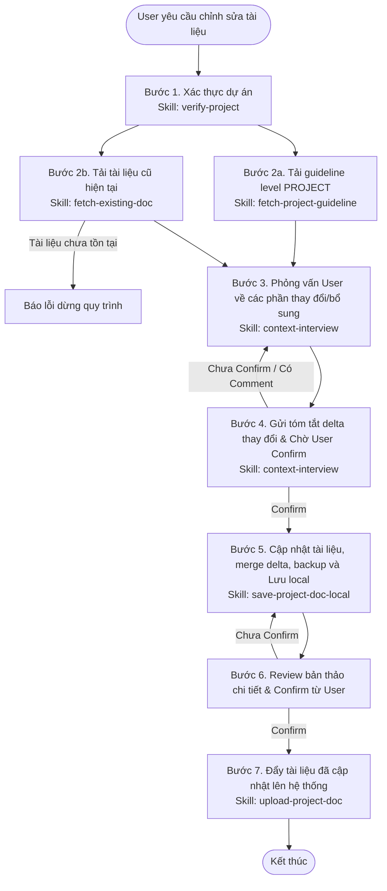

# Workflow: Chỉnh sửa tài liệu cấp dự án cho dự án đã tồn tại

## Description
Quy trình này hướng dẫn Lux thực hiện các bước để chỉnh sửa, cập nhật một tài liệu cấp dự án đã có trên hệ thống. Khác với quy trình xây dựng mới, Lux bắt buộc phải tải tài liệu cũ hiện tại về để đối chiếu và merge delta, đồng thời tạo Changelog cập nhật lịch sử.

## Triggers
- **Manual Command:** Khi User yêu cầu: *"Lux, hãy chỉnh sửa tài liệu [A] cho dự án [X]"* hoặc *"Lux, hãy cập nhật tài liệu [A] cho dự án [X]"*.

## Flow Diagram

## Execution Steps Matrix

| # | Bước (Action) | Actor | Tool/Skill mã hóa | Kết quả đầu ra (Output) |
|---|---|---|---|---|
| 1 | Xác thực xem dự án X có tồn tại trên hệ thống hay không | Lux | [verify-project](../skills/local-mcp/verify-project/SKILL.md) | Biến `is_valid` = `true` (nếu không có thì dừng báo lỗi) |
| 2a | Lấy guideline mẫu chuẩn cấp PROJECT của tài liệu A | Lux | [fetch-project-guideline](../skills/local-mcp/fetch-project-guideline/SKILL.md) | Nội dung `guideline_content` làm barem cấu trúc |
| 2b | Tải tài liệu A hiện tại của dự án X | Lux | [fetch-existing-doc](../skills/local-mcp/fetch-existing-doc/SKILL.md) | Nội dung `existing_doc_content` (dừng báo lỗi nếu không tìm thấy) |
| 3 | Lập câu hỏi phỏng vấn tối giản gửi User về phần chỉnh sửa | Lux | [context-interview](../skills/context-interview/SKILL.md) | Phản hồi giải đáp về phần delta cần cập nhật |
| 4 | Tổng hợp tóm tắt delta thay đổi và gửi User confirm | Lux | [context-interview](../skills/context-interview/SKILL.md) | Bản tóm tắt delta đã được User đồng ý (confirm) |
| 5 | Cập nhật tài liệu (merge delta, thêm Changelog ở cuối), backup file cũ và lưu local | Lux | [save-project-doc-local](../skills/save-project-doc-local/SKILL.md) | Ghi đè file mới tại `{projectKey}/{name}`, file cũ chuyển vào backup |
| 6 | Đẩy tài liệu đã cập nhật lên server hệ thống | Lux | [upload-project-doc](../skills/local-mcp/upload-project-doc/SKILL.md) | Xác nhận upload tài liệu thành công |

## Definition of Done (DoD)
* [ ] Dự án X đã được xác thực thành công qua tool `projects_list`.
* [ ] Đã tải thành công guideline mẫu `guideline://PROJECT/[name]`.
* [ ] Đã tải thành công tài liệu hiện tại `project-document://[projectKey]/[name]` (nếu file không tồn tại, quy trình đã dừng và báo lỗi cho User).
* [ ] Phỏng vấn User về nội dung thay đổi được thực hiện tối giản (< 5 câu).
* [ ] Bản tóm tắt delta thay đổi được User confirm đồng ý trước khi sửa.
* [ ] File cũ được backup thành công sang `{projectKey}/backup/[name].[timestamp].bak`.
* [ ] Cập nhật thành công tài liệu (merge delta, bổ sung bảng Changelog ở cuối) và lưu local tại `{projectKey}/{name}`.
* [ ] Bản thảo cập nhật đầy đủ được User review và confirm đồng ý.
* [ ] Gọi MCP tool `upload_project_doc` thành công để đồng bộ tài liệu mới lên server.
