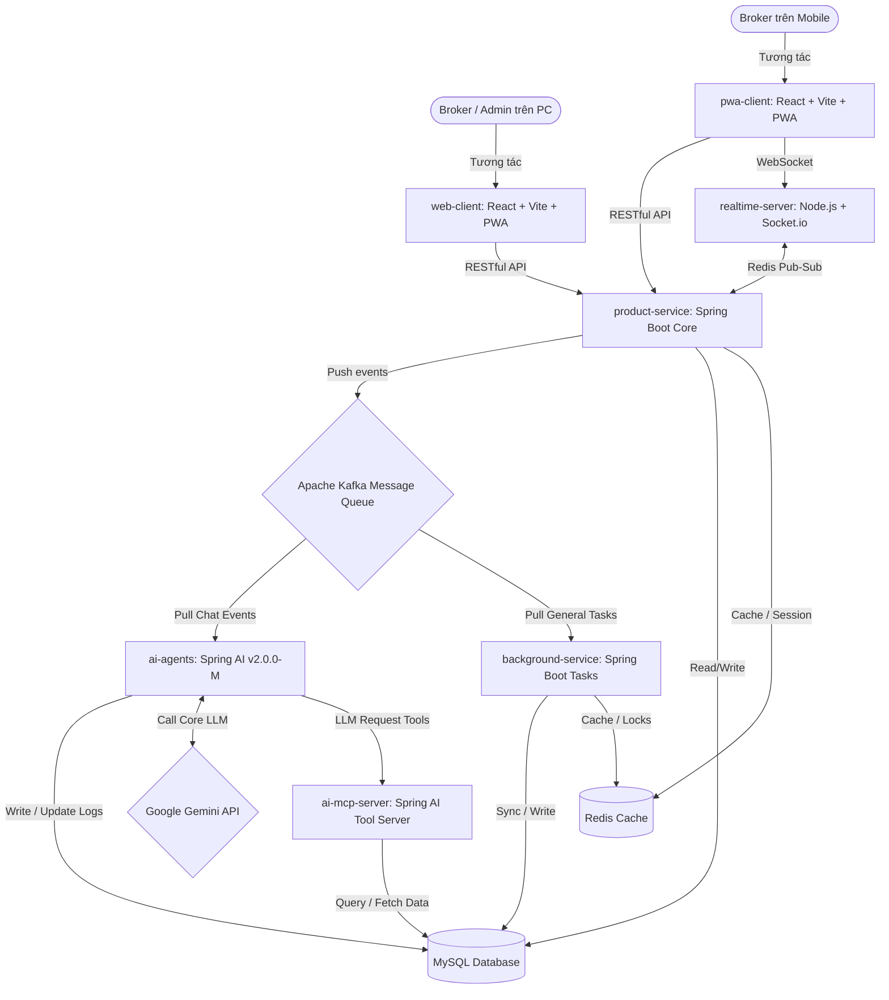

# 04-tech-stack.md (TECH STACK & ARCHITECTURE)

## 1. Sơ Đồ Kiến Trúc Tổng Thể (High-level Architecture)

Hệ thống được thiết kế theo mô hình kiến trúc hướng sự kiện (Event-driven Architecture) kết hợp với các dịch vụ chuyên biệt (Microservices/Modular Monolith) để tối ưu hóa hiệu năng, tính bất đồng bộ khi điều phối AI và tính thời gian thực khi chat.

---

## 2. Chi Tiết Stack Công Nghệ (Technology Details)

Hệ thống được triển khai trên nền tảng công nghệ hiện đại, phân tách rõ ràng trách nhiệm giữa các dịch vụ:

| Thành phần hệ thống | Công nghệ & Phiên bản | Vai trò & Ứng dụng cụ thể |
|---|---|---|
| **Frontend PC (`web-client`)** | React 18, Vite, Gói PWA, Vanilla CSS | Xây dựng giao diện web mượt mà, CMS quản trị dự án BĐS và phân phối gói cước môi giới cho PC. |
| **Frontend Mobile (`pwa-client`)** | React 18, Vite, Gói PWA, Vanilla CSS | Giao diện tối ưu hóa cho di động dưới dạng Progressive Web App, giúp Broker quản lý và tương tác nhanh với lead. |
| **Backend Core (`product-service`)** | Java 17, Spring Boot 3.x, Spring Web | Trọng tâm xử lý API nghiệp vụ, quản lý dữ liệu, xác thực **ID-system** qua JWT Token, và phân phối logic nghiệp vụ. |
| **AI Agents Core (`ai-agents`)** | Java 17, **Spring AI v2.0.0-M (Milestone)** | Tác nhân thông minh xử lý suy nghĩ, hội thoại với khách hàng, tự động kéo sự kiện (pull-events) tin nhắn Broker gửi đến từ Kafka. |
| **AI Tool Server (`ai-mcp-server`)** | Java 17, Spring Boot | Đóng vai trò làm cổng cung cấp công cụ thực thi (MCP tools/functions) khi LLM từ `ai-agents` thực hiện request tools; có khả năng truy xuất trực tiếp dữ liệu từ MySQL DB để phục vụ các truy vấn của công cụ. |
| **Realtime Service (`realtime-server`)** | Node.js v20, Socket.io | Đảm bảo kết nối WebSocket thời gian thực cho tin nhắn chat giữa khách hàng và AI/Broker, live reload, và thông báo tức thời. |
| **Background Tasks (`background-service`)** | Java 17, Spring Boot 3.x, Spring Kafka | Chạy ngầm xử lý các công việc khác ngoài AI: đồng bộ dữ liệu lead, chạy tác vụ lập lịch (schedule task), lắng nghe Kafka và Redis. |
| **Cơ sở dữ liệu chính** | MySQL v8.x | Hệ quản trị cơ sở dữ liệu quan hệ lưu trữ thông tin dự án BĐS, dữ liệu Broker, cấu hình chatbot, nhật ký hội thoại và phân phối Lead. |
| **Hàng đợi tin nhắn** | Apache Kafka v3.x | Đảm bảo tính bất đồng bộ khi điều phối tác vụ quét lead từ các nguồn mạng xã hội về hệ thống lõi. |
| **Caching & Pub-Sub** | Redis v7.x | Lưu trữ tạm thời trạng thái thiết bị mô phỏng, session đăng nhập, và làm cầu nối Redis Pub-Sub cho Socket.io. |

---

## 3. Quản Trị Mã Nguồn & Triển Khai (Version Control & Deployment)

- **Quản lý mã nguồn:** Sử dụng hệ thống Git lưu trữ tập trung tại tổ chức (GitHub/GitLab). Quy trình phát triển tuân thủ nghiêm ngặt mô hình **GitFlow Standard** (`main` phục vụ release sản phẩm, `develop` tích hợp tính năng mới, `feature/*` phát triển task chi tiết).
- **Hạ tầng triển khai:** Triển khai độc lập trên hạ tầng **On-premise (Hệ thống máy chủ vật lý riêng của công ty)**.
  - Sử dụng **Docker** để đóng gói toàn bộ 7 dịch vụ thành các container biệt lập (bao gồm cả `ai-agents`).
  - Sử dụng **Docker Compose** và **Docker Swarm** để quản lý và vận hành trực tiếp các container trên các máy chủ vật lý.
- **Quy trình CI/CD:** Sử dụng công cụ tự động hóa **GitHub Actions**:
  - Tự động chạy Unit Test và rà soát cú pháp (Lint) khi có Pull Request vào nhánh `develop`.
  - Tự động đóng gói Docker Image khi merge code thành công và đẩy lên Registry nội bộ của công ty.

---

## 4. Các Dịch Vụ Tích Hợp (3rd Party Services / External Integrations)

| Phân loại dịch vụ | Nhà cung cấp (Provider) | Mục đích & Phạm vi tích hợp |
|---|---|---|
| **AI LLM API** | Google Gemini API (Core) / Các LLM khác (Fallback) | Cung cấp mô hình ngôn ngữ lớn cốt lõi (Gemini) để sinh nội dung tiếp thị, lập kế hoạch chiến dịch và trò chuyện tự nhiên với khách hàng. |
| **Hệ thống ID-system** | Xác thực nội bộ qua JWT | Hệ thống ID-system xác thực và cấp phát JWT token với thời hạn cố định 7 ngày, bảo mật API và Socket, bảo vệ dữ liệu lead. |
| **Notification** | Firebase Cloud Messaging (FCM) | Gửi các thông báo đẩy (Push Notification) về thiết bị di động của môi giới khi có lead nóng Level 3 xuất hiện. |
| **Lưu trữ dữ liệu ảnh** | Chuẩn S3 Storage (Minio self-host / Cloudflare R2) | Lưu trữ hình ảnh dự án bất động sản, ảnh banner, avatar marketing do AI sinh ra hoặc môi giới tải lên. |

> [!CAUTION]
> Tuyệt đối KHÔNG commit các thông tin bảo mật nhạy cảm (như mật khẩu cơ sở dữ liệu, API Keys) vào mã nguồn Git. Mọi thông tin này phải được quản lý tập trung qua **biến môi trường hệ điều hành (OS Environment Variables)** trực tiếp trên máy chủ vật lý On-premise hoặc **GitHub Secrets**.

---

## Lịch Sử Cập Nhật (Changelog)

| Phiên bản | Ngày | Người cập nhật | Nội dung thay đổi |
|---|---|---|---|
| v1.0 | 2026-05-10 | Admin | Bản thảo khởi tạo ban đầu. |
| v1.1 | 2026-05-26 | Lux - Project-Level Documentation Specialist | Chuẩn hóa sơ đồ kiến trúc 7 dịch vụ thực tế (bao gồm `ai-agents` độc lập), chuyển đổi database sang MySQL, tích hợp công nghệ React/Vite/PWA, Spring AI v2.0.0-M với Google Gemini làm core LLM và hạ tầng triển khai On-premise của công ty. |
