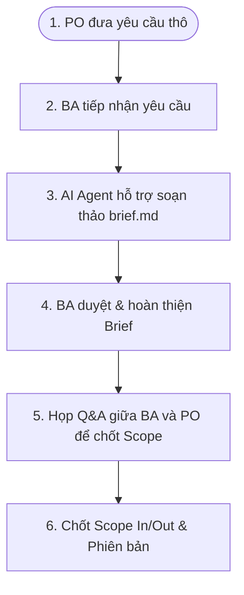
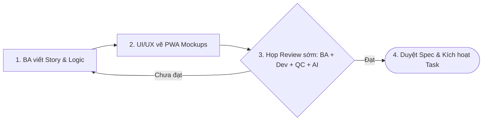

# 06-workflow-and-process.md (QUY TRÌNH VẬN HÀNH & PHỐI HỢP DỰ ÁN)

Tài liệu này quy định quy trình phối hợp vận hành chung giữa đội ngũ nhân sự (Con người) và các tác nhân thông minh (AI Agents) trong suốt vòng đời phát triển của dự án **Property AI (PAI)**. Quy trình này thiết lập các bước làm việc có kiểm duyệt (Human-in-the-loop) để bảo đảm chất lượng nghiệp vụ cao nhất và hạn chế sai sót.

---

## 1. Quy trình Tiếp nhận & Xác chuẩn (Request Intake & Baseline)

Quy trình xử lý ngay khi có yêu cầu nghiệp vụ mới hoặc đề xuất tính năng AI mới từ phía Khách hàng hoặc Product Owner (PO):

- **Bước 1 (Tiếp nhận):** PO bàn giao yêu cầu nghiệp vụ sơ bộ hoặc ý tưởng (Ví dụ: "Hỗ trợ môi giới thiết lập các hạn mức tin nhắn chat tự động theo các gói cước 200k, 500k, 1.5M").
- **Bước 2 (Phân loại):** BA tiếp nhận yêu cầu, phân tích tác động sơ bộ tới cấu trúc 6 dịch vụ hiện hành.
- **Bước 3 (Dự thảo bằng AI):** BA sử dụng Trợ lý ảo AI soạn thảo nhanh bản nháp `brief.md` để tóm tắt các Pain Points và mục tiêu cốt lõi của tính năng.
- **Bước 4 (BA phê duyệt):** BA trực tiếp rà soát, chỉnh sửa bản thảo `brief.md` để đảm bảo tính logic nghiệp vụ và cam kết giá trị.
- **Bước 5 (Xác chuẩn):** BA tổ chức họp nhanh Q&A với PO để thống nhất các câu hỏi còn thiếu, chốt lằn ranh đỏ (In-Scope / Out-of-Scope) làm căn cứ Baseline cho tài liệu thiết kế.

---

## 2. Quy trình Phối hợp Sản xuất Spec (The Production Loop)

Quy trình phối hợp biến `brief.md` đã xác chuẩn thành bộ hồ sơ thiết kế kỹ thuật (Spec) chi tiết, giảm thiểu đứt gãy thông tin giữa BA -> Dev -> QC:

- **Bước 1 (Soạn thảo kịch bản):** BA soạn thảo chi tiết các User Stories, quy tắc gói cước sử dụng, định dạng phản hồi API chuẩn và các kịch bản AI Nurturing Level 3.
- **Bước 2 (Thiết kế UI/UX):** Designer vẽ giao diện PWA cho PC (`web-client`) và Mobile (`pwa-client`), chú trọng trải nghiệm hiển thị khi Broker quản lý lead và lịch sử AI chat.
- **Bước 3 (Handshake - Review sớm):** BA tổ chức buổi xem xét chung:
  - **Tech Lead (và AI Code Assistant):** Đánh giá tính khả thi khi tích hợp Spring AI 2.0.0-M, hàng đợi Kafka, và kiến trúc CSDL MongoDB.
  - **QC Lead:** Rà soát để lập các kịch bản kiểm thử (Test Scenarios) bao gồm cả trường hợp AI phản hồi sai thông tin.
- **Bước 4 (Duyệt Spec):** Bộ Spec sau khi được chỉnh sửa và đồng thuận sẽ được duyệt để đưa vào kế hoạch Sprint.

---

## 3. Quy trình Bàn giao & Kích hoạt Thực thi (Handover & Activation)

Chuyển giao tri thức thiết kế sang bộ phận kỹ thuật để bắt đầu lập trình và viết mã kiểm thử:

- **Bước 1 (Họp Handover):** BA giải thích logic nghiệp vụ và các ràng buộc dữ liệu cho toàn bộ team phát triển. Nhấn mạnh cơ chế xác thực JWT qua ID-system nội bộ để đảm bảo an toàn.
- **Bước 2 (Phân rã Task):** Tech Lead phân rã Spec thành các nhiệm vụ lập trình cụ thể cho 6 repositories (`product-service`, `web-client`, `pwa-client`, `ai-mcp-server`, `realtime-server`, `background-service`).
- **Bước 3 (Kích hoạt thực thi):**
  - **Lập trình viên (và Agent):** checkout các nhánh `feature/*` tương ứng và bắt đầu phát triển code nghiệp vụ.
  - **QC:** Bắt đầu xây dựng bộ test tự động sử dụng **Custom Pytest Framework** song song với việc Dev viết code.
- **Bước 4 (Quality Gates):** Thiết lập các chốt chặn tự động kiểm tra cú pháp (Lint), tính đồng nhất của API và chạy Unit Test ngay khi Developer mở Pull Request (PR) trên Git.

---

## 4. Quy trình Quản trị Thay đổi (Change Request Workflow)

Quy trình xử lý khi PO/Khách hàng có yêu cầu sửa đổi tính năng giữa chừng khi dự án đang trong quá trình phát triển (Sprint):

1. **Tiếp nhận Yêu cầu thay đổi (CR):** PO gửi yêu cầu thay đổi (Ví dụ: "Thay đổi số tin nhắn tự động của gói Standard từ 2,000 lên 3,000 tin nhắn/tháng").
2. **Đánh giá Tác động (Impact Analysis):** BA phối hợp cùng Tech Lead đánh giá nhanh:
   - Thay đổi này ảnh hưởng đến những repository nào? (Ví dụ: thay đổi cấu hình DB trong `product-service`, logic check hạn mức trong `background-service`).
   - Có phát sinh chi phí token AI không? Mức độ ảnh hưởng đến tiến độ release?
3. **Quyết định (Decision):** PO quyết định áp dụng thay đổi ngay lập tức (nếu khẩn cấp) hoặc chuyển vào Backlog để triển khai trong các Sprint tiếp theo.
4. **Đồng bộ hóa tài liệu & Code:**
   - BA cập nhật ngay thay đổi vào [01-overview.md](./01-overview.md) (Mục 9) và [02-roles-and-boundaries.md](./02-roles-and-boundaries.md).
   - Đánh dấu phiên bản tài liệu tăng tiến kèm Changelog chi tiết.
   - Thông báo cho Dev và QC cập nhật code và kịch bản test tương ứng.

---

## Lịch Sử Cập Nhật (Changelog)

| Phiên bản | Ngày | Người cập nhật | Nội dung thay đổi |
|---|---|---|---|
| v1.0 | 2026-05-10 | Admin | Bản thảo khởi tạo ban đầu. |
| v1.1 | 2026-05-26 | Lux - Project-Level Documentation Specialist | Chuẩn hóa quy trình vận hành chung (Human-in-the-loop) phối hợp nhịp nhàng giữa con người và AI Agents trong chu trình Agile, đồng bộ với kiến trúc 6 repositories mới. |
