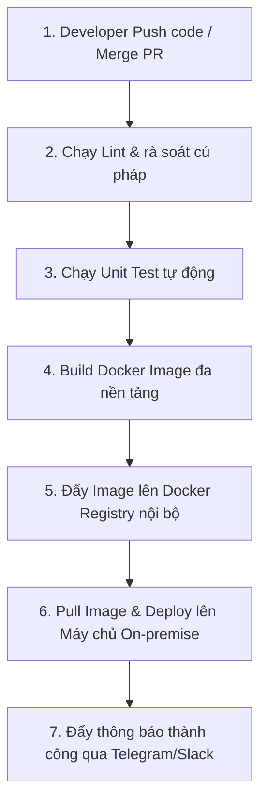

# 09-devops-playbook.md (HƯỚNG DẪN VẬN HÀNH & TRIỂN KHAI)

Tài liệu này quy định quy trình đóng gói, quản lý cấu hình, tích hợp liên tục (CI/CD) và vận hành hạ tầng máy chủ cho toàn bộ 6 dịch vụ của dự án **Property AI (PAI)** trên hệ thống máy chủ vật lý riêng của công ty (**On-premise**).

---

## 1. Quản Lý Môi Trường (Environment Management)

Dự án PAI được vận hành thống nhất trên 3 môi trường chính để phục vụ quá trình phát triển, kiểm thử chất lượng và phát hành thực tế. 100% các môi trường đều được Docker hóa để đảm bảo tính đồng nhất:

| Môi trường | Nhánh Git | Hạ tầng triển khai | Địa chỉ truy cập (URL) | Công nghệ quản lý |
|---|---|---|---|---|
| **Development (Dev)** | `develop` | Hệ thống máy chủ ảo hóa nội bộ (Local Virtual Server) | `https://dev-api.propertyai.vn` | Docker Compose độc lập, Redis, MongoDB |
| **Staging (QA/UAT)** | `release/*` | Máy chủ vật lý Staging tại Data Center của công ty | `https://staging-api.propertyai.vn` | Docker Swarm (triển khai các phiên bản thử nghiệm AI Nurturing) |
| **Production (Prod)** | `main` | Cụm máy chủ vật lý chuyên biệt On-premise | `https://api.propertyai.vn` | Docker Swarm, cụm MongoDB Sharded, Kafka cluster, Redis |

---

## 2. Quy Trình CI/CD (CI/CD Pipeline)

Dự án tự động hóa tối đa từ khâu đẩy mã nguồn lên GitHub cho đến khi triển khai thực tế trên máy chủ On-premise thông qua công cụ **GitHub Actions** phối hợp với các agent tự động:

- **Quy trình chi tiết tại GitHub Actions (`.github/workflows/deploy.yml`):**
  - **Lint & Test:** Khi có PR mở vào nhánh `develop`, GitHub Runner sẽ tự động khởi chạy môi trường để chạy unit test cho Spring Boot (`product-service`, `background-service`, `ai-mcp-server`), React (`web-client`, `pwa-client`) và Node.js.
  - **Docker Build & Tag:** Sau khi vượt qua vòng kiểm thử, hệ thống tự động build Docker image.
    - Cấu trúc Tag: `:dev-[commit-hash]` cho nhánh develop, và `:latest` hoặc `:[version-number]` cho nhánh main.
  - **Deployment:** GitHub Runner thực hiện gọi API an toàn tới cổng Gateway Agent của hệ thống máy chủ On-premise để ra lệnh thực hiện kéo (pull) image mới nhất và chạy lệnh `docker stack deploy` để cập nhật các container trên Docker Swarm mà không gây gián đoạn dịch vụ (Zero-downtime Deployment).

---

## 3. Cấu Hình & Bí Mật (Config & Secret Management)

Hạ tầng On-premise tuân thủ nghiêm ngặt quy trình an toàn bảo mật thông tin, bảo vệ tài nguyên mật khẩu cơ sở dữ liệu và API Keys của các LLMs lớn:

- **Nguyên tắc "Lằn ranh đỏ":** Tuyệt đối **KHÔNG** commit các file cấu hình nhạy cảm `.env`, mật khẩu MongoDB, hoặc các API Keys (OpenAI, Gemini, Claude) vào mã nguồn Git. Mọi file `.env` phải được thêm vào `.gitignore`.
- **Cơ chế quản lý trên Staging & Production:**
  - **Mã khóa bảo mật (Secrets):** Toàn bộ API Keys và mật khẩu kết nối được lưu trữ bảo mật dưới dạng **Biến môi trường hệ điều hành (OS Environment Variables)** trực tiếp trên các máy chủ vật lý hoặc thông qua công cụ **GitHub Secrets** phục vụ quá trình build.
  - **Cấu hình động:** `product-service` và `background-service` sử dụng file `application.yml` kết hợp cấu hình đọc trực tiếp các biến môi trường dạng `${OPENAI_API_KEY}` để lấy dữ liệu thực tế lúc khởi chạy container Docker.
- **Môi trường cục bộ (Local Development):** Lập trình viên sử dụng file mẫu `application.yml.example` hoặc `.env.example` để tự cấu hình trên máy tính cá nhân.

---

## 4. Dự Phòng & Khôi Phục (Backup & Disaster Recovery)

Hạ tầng máy chủ vật lý On-premise của công ty bắt buộc phải trang bị cơ chế sao lưu định kỳ để chống mất mát dữ liệu khách hàng tiềm năng và cấu hình bot:

- **Sao lưu Cơ sở dữ liệu (MongoDB Backup):**
  - Thiết lập một Cronjob tự động chạy lệnh `mongodump` toàn bộ dữ liệu lead, lịch sử chat và cấu hình chiến dịch hàng ngày vào lúc **01:00 AM** (thời điểm lượng truy cập thấp nhất).
  - Bản sao lưu sau khi Dump sẽ được nén dưới định dạng `.tar.gz`, tự động mã hóa bằng thuật toán AES-256.
- **Lưu trữ độc lập:** Các file nén sao lưu được tự động đẩy về hệ thống máy chủ lưu trữ dữ liệu độc lập (Cloud Storage nội bộ hoặc tài khoản lưu trữ bảo mật AWS S3/Cloudinary của công ty) và lưu giữ trong vòng **30 ngày**.
- **Kịch bản Khôi phục thảm họa (Disaster Recovery Timeline):**
  - Trong trường hợp toàn bộ hệ thống máy chủ vật lý On-premise gặp sự cố cháy nổ hoặc hỏng hóc phần cứng:
    - Quy trình khởi tạo lại hệ sinh thái 6 container dịch vụ bằng **Docker Compose** hoặc **Docker Swarm** trên máy chủ dự phòng phải hoàn tất trong vòng **< 20 phút**.
    - Quy trình khôi phục (restore) toàn bộ dữ liệu MongoDB từ bản backup gần nhất phải hoàn thành trong vòng **< 15 phút**, đảm bảo tổng thời gian gián đoạn hệ thống tối đa dưới 45 phút.

---

## Lịch Sử Cập Nhật (Changelog)

| Phiên bản | Ngày | Người cập nhật | Nội dung thay đổi |
|---|---|---|---|
| v1.0 | 2026-05-10 | Admin | Bản thảo khởi tạo ban đầu. |
| v1.1 | 2026-05-26 | Lux - Project-Level Documentation Specialist | Chuẩn hóa quy trình vận hành và triển khai, chuyển cấu trúc hạ tầng từ Cloud sang **On-premise máy chủ vật lý riêng của công ty**, đồng bộ kiến trúc 6 dịch vụ thực tế và liên kết chéo hệ thống. |
