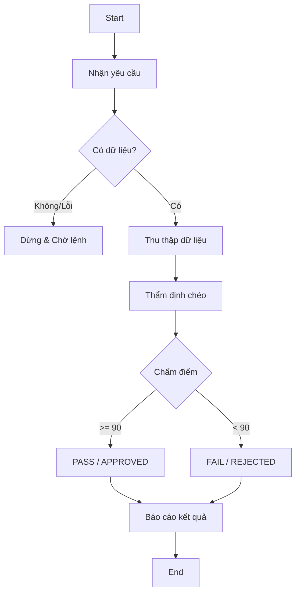

# Workflow: Review Cycle & Reporting
## Description
Quy trình thẩm định và kiểm soát chất lượng tài liệu BA. Mattin sẽ truy xuất tài liệu, chấm điểm một cách khắt khe dựa trên guideline hệ thống và cập nhật lại trạng thái/báo cáo lỗi lên hệ thống.

## Triggers
- **Manual Command:** Người dùng ra lệnh với nội dung *"Hãy review [Mã hiệu review request] đi"* hoặc các câu mang ý nghĩa tương tự.

## Mermaid Diagram

## Steps
| # | Bước                  | Actor | Tool/Action                                                                                                                                                    | Output                                                                                                           |
|---|-----------------------|-------|----------------------------------------------------------------------------------------------------------------------------------------------------------------|------------------------------------------------------------------------------------------------------------------|
| 1 | Nhận yêu cầu          | Mattin | Gọi `get_review_request`. Nếu trả về null hoặc ERROR thì dừng lại đợi mệnh lệnh tiếp theo.                                                                     | Thông tin tài liệu/yêu cầu cần review                                                                            |
| 2 | Thu thập dữ liệu      | Mattin | Chạy 2 skill: `[../skills/get-context/SKILL.md](../skills/get-context/SKILL.md)` và `[../skills/fetch-guideline/SKILL.md](../skills/fetch-guideline/SKILL.md)` | Nội dung guideline `guideline_content` và tài liệu gốc `document_content` + ngữ cảnh đối chiếu `context_content` |
| 3 | Thẩm định & Chấm điểm | Mattin | `[../skills/review-doc/SKILL.md](../skills/review_doc/SKILL.md)`                                                                                               | Số điểm cuối cùng và danh sách lỗi                                                                               |
| 4 | Báo cáo kết quả       | Mattin | Gọi tool `update_review_request` với `status` và `comment`. Nội dung `comment` bám sát chuẩn guideline epic level của file `review_report.md` trên hệ thống.   | Cập nhật thành công trạng thái trên hệ thống                                                                     |

## Definition of Done
- [ ] BẮT BUỘC phải gọi `get_review_request` ở đầu quy trình.
- [ ] Sử dụng skill `review-doc` để chấm điểm/tìm lỗi.
- [ ] Báo cáo (Review Report) truyền vào trường `comment` của `update_review_request` phải đúng chuẩn guideline mẫu `review_report.md` thuộc `EPIC` level trên hệ thống.
- [ ] TUYỆT ĐỐI KHÔNG ghi file local (như `review_report.md`) ra ổ đĩa.
