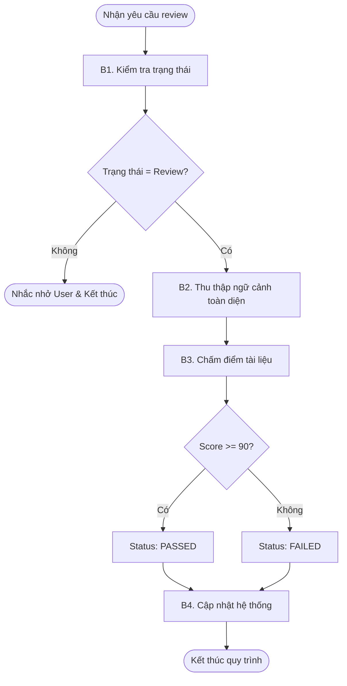

# Workflow: Review Cycle & Reporting
## Description
Quy trình thẩm định và kiểm soát chất lượng tài liệu BA. Mattin sẽ kiểm tra trạng thái yêu cầu, truy xuất tài liệu và toàn bộ ngữ cảnh hệ thống (giống như Lina), chấm điểm khắt khe và cập nhật báo cáo lỗi.

## Triggers
- **Manual Command:** Người dùng ra lệnh với nội dung *"Hãy review [Mã hiệu review request] đi"* hoặc các câu mang ý nghĩa tương tự.

## Mermaid Diagram

## Steps
| # | Bước | Actor | Tool/Action | Output |
|---|------|-------|-------------|--------|
| 1 | Tiếp nhận & Kiểm tra | Mattin | Gọi `[../skills/mattin-mcp/get-review-request/SKILL.md](../skills/mattin-mcp/get-review-request/SKILL.md)`. Kiểm tra trạng thái yêu cầu. Nếu không phải trạng thái "đang chờ review" $\rightarrow$ Nhắc nhở User và dừng luồng chạy ngay lập tức. | Xác nhận yêu cầu hợp lệ để review. |
| 2 | Thu thập ngữ cảnh | Mattin | Gọi liên hoàn các kỹ năng: `[../skills/get-context/SKILL.md](../skills/get-context/SKILL.md)` (Lấy tài liệu chính) $\rightarrow$ `[../skills/mattin-mcp/research-project-overview/SKILL.md](../skills/mattin-mcp/research-project-overview/SKILL.md)` $\rightarrow$ `[../skills/mattin-mcp/research-historical-context/SKILL.md](../skills/mattin-mcp/research-historical-context/SKILL.md)` $\rightarrow$ `[../skills/mattin-mcp/research-db-spec/SKILL.md](../skills/mattin-mcp/research-db-spec/SKILL.md)` $\rightarrow$ `[../skills/mattin-mcp/research-api-spec/SKILL.md](../skills/mattin-mcp/research-api-spec/SKILL.md)`. | Dữ liệu ngữ cảnh toàn diện y hệt như Lina phục vụ review đối chiếu. |
| 3 | Chấm điểm tài liệu | Mattin | Sử dụng `[../skills/review-doc/SKILL.md](../skills/review-doc/SKILL.md)`. - Điểm `>= 90`: status `PASSED` - Điểm `< 90`: status `FAILED` - Soạn `comment`: Bám sát form `review_report.md` level EPIC, dùng văn phong "Vai ác". | Trạng thái (PASSED/FAILED) và nội dung Comment. |
| 4 | Báo cáo kết quả | Mattin | Gọi `[../skills/mattin-mcp/update-review-request/SKILL.md](../skills/mattin-mcp/update-review-request/SKILL.md)` truyền vào các biến `reviewKey`, `status` và `comment`. | Trạng thái yêu cầu được cập nhật thành công trên hệ thống. |

## Definition of Done
- [ ] BẮT BUỘC phải sử dụng kỹ năng `get-review-request` ở đầu quy trình để xác minh trạng thái. Chặn ngay nếu sai trạng thái.
- [ ] BẮT BUỘC phải thu thập đầy đủ ngữ cảnh qua các kỹ năng tổ hợp (Project Overview, Historical Context, DB/API Spec) để đối chiếu bối cảnh giống hệt như Lina.
- [ ] Tuân thủ tuyệt đối mốc 90 điểm để quyết định trạng thái PASSED/FAILED.
- [ ] Báo cáo (Review Report) truyền vào trường `comment` của kỹ năng `update-review-request` phải đúng chuẩn định dạng.
- [ ] TUYỆT ĐỐI KHÔNG ghi file local ra ổ đĩa.
