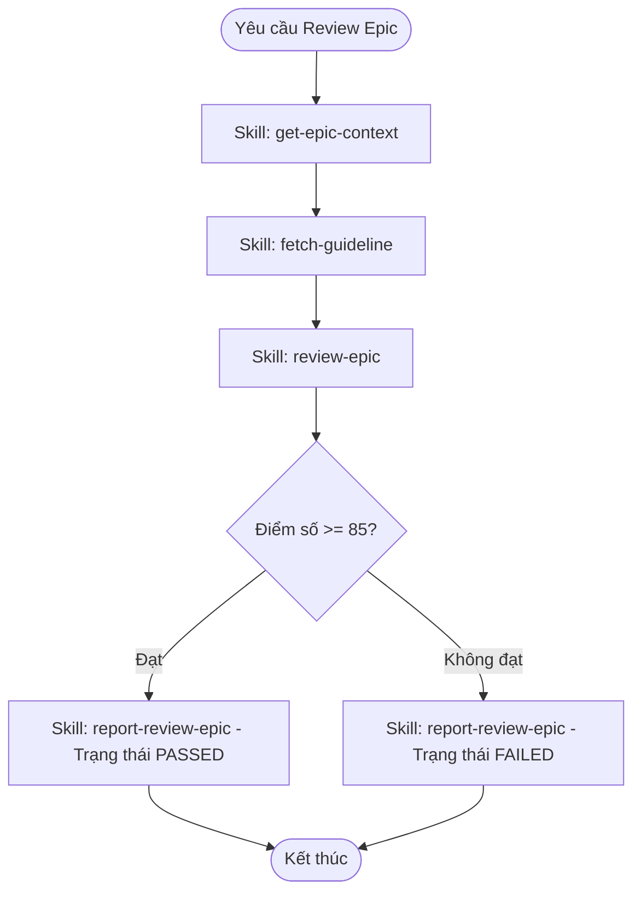

# Workflow: Thẩm định và đánh giá Epic Brief (Epic Review)

## Description
Quy trình này hướng dẫn Mattin (BA Lead) cách tiếp nhận một Epic, tải toàn bộ context nghiệp vụ, thẩm định chất lượng tài liệu Epic Brief (`brief.md`) của BA dựa trên 4 nhóm tiêu chí khắt khe, chấm điểm và báo cáo kết quả đánh giá (PASSED/FAILED) lên hệ thống.

## Triggers
- Khi User yêu cầu review một Epic cụ thể (Ví dụ: "Mattin, hãy review Epic PAI-EPIC-46").
- Hoặc khi hệ thống kích hoạt tự động sau khi BA cập nhật tài liệu Epic.

## Flow Diagram

## Execution Steps Matrix

| # | Bước (Action) | Actor | Tool/Skill mã hóa | Kết quả đầu ra (Output) |
|---|---|---|---|---|
| 1 | Tải toàn bộ bối cảnh của Epic cần review | Mattin | [get-epic-context](../skills/mattin-mcp/get-epic-context/SKILL.md) | Biến `epicDocuments` (chứa nội dung file `brief.md` được BA lưu local) và `storyList` |
| 2 | Đọc tài liệu guideline và biểu mẫu quy chuẩn của Epic | Mattin | [fetch-guideline](../skills/fetch-guideline/SKILL.md) | Biểu mẫu chuẩn và tiêu chí trình bày của Epic |
| 3 | Thực hiện thẩm định sâu 4 nhóm tiêu chí chất lượng và chấm điểm | Mattin | [review-epic](../skills/review-epic/SKILL.md) | Điểm số tổng, trạng thái đánh giá (`status`) và báo cáo nhận xét chi tiết (`comment`) |
| 4 | Đẩy kết quả đánh giá và comment báo cáo lên hệ thống | Mattin | [report-review-epic](../skills/mattin-mcp/report-review-epic/SKILL.md) | Ghi nhận kết quả review thành công trên hệ thống qua MCP Tool |

## Definition of Done (DoD)
* [ ] Đã tải thành công tài liệu Epic và nội dung `brief.md` để đối chiếu.
* [ ] Tài liệu được đánh giá đầy đủ qua 4 nhóm tiêu chí (Nghiệp vụ, Truyền tải, Kiểm thử, Chuẩn hóa).
* [ ] Đã chấm điểm cụ thể trên thang 100 và kết luận trạng thái (`PASSED` nếu điểm >= 85, ngược lại `FAILED`).
* [ ] Đã gọi MCP tool `report_review_epic` thành công để đồng bộ kết quả và nội dung review lên hệ thống.
* [ ] Báo cáo lỗi được viết đúng văn phong nghiêm khắc, thẳng thắn của BA Lead.
