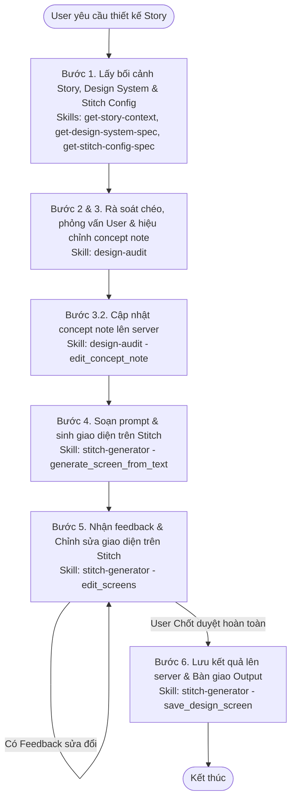

# Workflow: Quy Trình Thiết Kế Giao Diện Story (Story Design Flow)

## Description
Quy trình này hướng dẫn Robin thực hiện các bước tuần tự từ việc tiếp nhận yêu cầu thiết kế giao diện cho Story, tải ngữ cảnh, Design System và cấu hình Stitch, rà soát chéo, phỏng vấn User để chốt concept note, gọi StitchMCP sinh/sửa giao diện, gọi `save_design_screen` lưu kết quả lên server và bàn giao output cuối cùng.

## Triggers
- **Manual Command:** Khi User yêu cầu trực tiếp trong chat: *"Robin, hãy thiết kế giao diện cho story {storyKey} của dự án {projectKey}"* (Ví dụ: *"Robin, hãy thiết kế giao diện cho story PAI-STORY-23 của dự án PAI"*).

## Flow Diagram

## Execution Steps Matrix

| # | Bước (Action) | Actor | Tool/Skill mã hóa | Kết quả đầu ra (Output) |
|---|---|---|---|---|
| 1.1 | Tải ngữ cảnh Story và trích xuất tài liệu đính kèm | Robin | [get-story-context](../skills/local-mcp/get-story-context/SKILL.md) | `projectKey`, `concept_note` (BA viết), `repository_select`, `user_story`, `user_flow` |
| 1.2 | Lấy đặc tả Design System cho repository UI | Robin | [get-design-system-spec](../skills/local-mcp/get-design-system-spec/SKILL.md) | Tài liệu `design_system_spec` của repo được chọn |
| 1.3 | Lấy Project ID và Design System ID của Stitch của repo | Robin | [get-stitch-config-spec](../skills/local-mcp/get-stitch-config-spec/SKILL.md) | Tham số cấu hình `stitchProjectId` và `stitchDesignSystemId` |
| 2 & 3 | Rà soát chéo, phỏng vấn User (dưới 5 câu) và hiệu chỉnh concept note | Robin | [design-audit](../skills/design-audit/SKILL.md) | Bản thiết kế concept note đã chốt và lưu local dưới tên `concept_note.md` |
| 3.2 | Đồng bộ tài liệu concept note đã chốt lên server | Robin | [design-audit](../skills/design-audit/SKILL.md) | Gọi MCP tool `edit_concept_note` cập nhật thành công lên server |
| 4 & 5 | Soạn prompt, sinh giao diện trên Stitch và chỉnh sửa theo feedback | Robin | [stitch-generator](../skills/stitch-generator/SKILL.md) | Gọi StitchMCP để tạo/sửa screens và trích xuất Stitch URL bàn giao cho User |
| 6.1 | Lưu trữ kết quả màn hình thiết kế lên server | Robin | [stitch-generator](../skills/stitch-generator/SKILL.md) | Gọi MCP tool `save_design_screen` cho từng màn hình thành công |
| 6.2 | Tổng hợp output cuối cùng và gửi bàn giao cho User | Robin | Không có skill riêng (Tổng hợp Output) | Gửi chat báo cáo chứa `storyKey`, `concept_note.md` đã chốt và danh sách màn hình kèm link Stitch URL |

## Definition of Done (DoD)
* [ ] Đã tải thành công bối cảnh Story qua tool `get_story_design_context` và trích xuất đúng `projectKey` cùng `repository_select`.
* [ ] Đã lấy thành công đặc tả Design System (`get_design_system`) và cấu hình Stitch (`get_stitch_config`) của repo UI.
* [ ] Đã rà soát chéo, phỏng vấn User tối giản (< 5 câu) giải quyết xung đột và lưu local `concept_note.md` đã chốt.
* [ ] Đã gọi MCP tool `edit_concept_note` để đồng bộ concept note đã chốt lên server.
* [ ] Đã sinh màn hình và hiệu chỉnh thành công trên StitchMCP, trích xuất được Stitch URL.
* [ ] Đã gọi MCP tool `save_design_screen` lưu trữ đầy đủ kết quả từng màn hình lên server sau khi User chốt hoàn toàn.
* [ ] Đã gửi chat tổng hợp output bàn giao (gồm `storyKey`, nội dung `concept_note.md` chốt, danh sách màn hình kèm Stitch URL) cho User.
