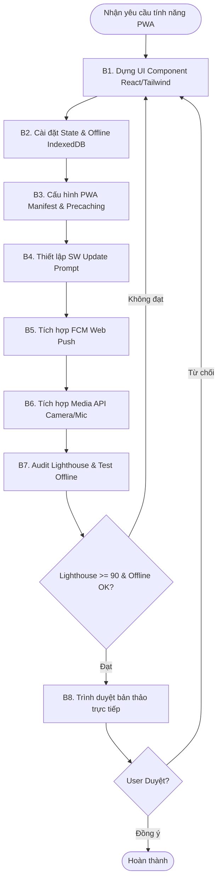

# Workflow: Quy Trình Phát Triển và Tích Hợp PWA Mobile Nâng Cao

## Description
Quy trình hướng dẫn Sanji xây dựng giao diện React Mobile-first, tích hợp PWA config (`vite-plugin-pwa`), cài đặt Service Worker, FCM push, Offline storage (IndexedDB) và thực hiện Audit chốt duyệt với User.

## Triggers
- **Manual Command:** Khi User yêu cầu: *"Sanji, hãy xây dựng tính năng [Tên tính năng] tích hợp PWA cho dự án PAI"*.

## Mermaid Diagram

## Steps (Ma Trận Thực Thi Các Bước)
| # | Bước (Action) | Actor | Tool/Skill mã hóa | Kết quả đầu ra (Output) |
|---|---------------------------|-------|-------------------|-------------------------|
| 1 | Dựng UI Mobile-First 60fps | Sanji | `[react-tailwind-builder](../skills/react-tailwind-builder/SKILL.md)` | React component styled bằng Tailwind + Framer Motion. |
| 2 | Cài đặt lưu trữ offline | Sanji | `[offline-storage](../skills/pwa/offline-storage/SKILL.md)` | IndexedDB service và logic Offline detector. |
| 3 | Cấu hình vite-plugin-pwa | Sanji | `[pwa-config](../skills/pwa/pwa-config/SKILL.md)` | Cấu hình `vite.config.js` PWA và Manifest. |
| 4 | Cài đặt SW Update Prompt | Sanji | `[sw-handler](../skills/pwa/sw-handler/SKILL.md)` | Hook `useRegisterSW` và `ReloadPrompt.jsx`. |
| 5 | Tích hợp FCM Web Push | Sanji | `[fcm-push](../skills/pwa/fcm-push/SKILL.md)` | FCM messaging client và background file `firebase-messaging-sw.js`. |
| 6 | Tích hợp Media API | Sanji | `[device-media](../skills/pwa/device-media/SKILL.md)` | Hooks `useCamera`, `useVoiceRecorder` kết nối phần cứng. |
| 7 | Audit & Kiểm nghiệm PWA | Sanji | Sử dụng Lighthouse DevTools & Network Offline. | Kết quả chạy offline OK và điểm số audit PWA/Performance >= 90. |
| 8 | Trình duyệt bản thảo | Sanji | Xuất mã nguồn trực tiếp trong chat. | Lời duyệt "Đồng ý/Duyệt" trực tiếp từ User. |

## Definition of Done (DoD)
- [ ] UI Mobile-first responsive, 60fps animation.
- [ ] Cấu hình `vite-plugin-pwa` hoàn tất, hỗ trợ A2HS.
- [ ] Tích hợp SW Update Prompt modal thông báo cập nhật.
- [ ] FCM push notification hoạt động foreground, background và offline.
- [ ] Truy cập Camera/Microphone di động qua Web API thành công, xuất file Blob/File.
- [ ] IndexedDB/localForage cache dữ liệu danh sách dự án/chiến dịch xem ngoại tuyến.
- [ ] Chỉ số Lighthouse Performance & PWA >= 90.
- [ ] Mã nguồn được User trực tiếp phê duyệt trong chat.
