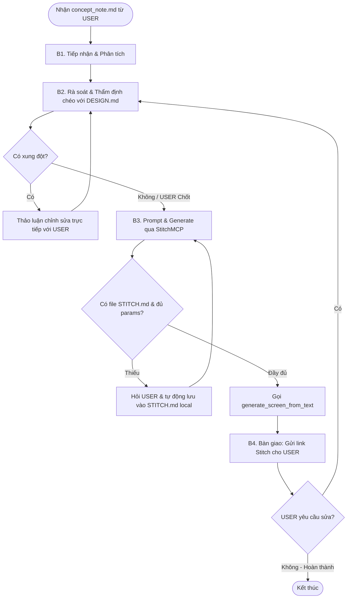

# Workflow: Quy Trình Thiết Kế và Sinh Giao Diện Màn Hình Qua Stitch

## Description
Quy trình hướng dẫn Robin phối hợp trực tiếp với User để tiếp nhận ý tưởng thô `concept_note.md`, rà soát giải quyết xung đột với Design System `DESIGN.md`, viết prompt kỹ thuật sinh giao diện qua StitchMCP (quản lý state/cấu hình qua file `STITCH.md` cục bộ), bàn giao link thiết kế và quản lý vòng lặp sửa đổi.

## Triggers
- **Manual Command:** Khi User yêu cầu: *"Robin, hãy thiết kế giao diện [Tên màn hình]"* hoặc khi có tài liệu `concept_note.md` được gửi đến.

## Mermaid Diagram

## Steps (Ma Trận Thực Thi Các Bước)
| # | Bước (Action) | Actor | Tool/Skill mã hóa | Kết quả đầu ra (Output) |
|---|----------------------------------|-------|-------------------|-------------------------|
| 1 | Tiếp nhận ý tưởng thô | Robin | Ý tưởng thô từ USER (file `.md` local, direct chat, hoặc system resource). | Nội dung tri thức thô của màn hình cần thiết kế. |
| 2 | Rà soát & Giải quyết xung đột | Robin | `[design-system-enforcer](../skills/design-system-enforcer/SKILL.md)` | Yêu cầu thiết kế hoàn toàn tuân thủ `DESIGN.md` (hoặc USER đã chốt duyệt phương án). |
| 3 | Prompt & Sinh màn hình Stitch | Robin | `[stitch-prompt-engineer](../skills/stitch-prompt-engineer/SKILL.md)` | File `STITCH.md` cục bộ được lưu đầy đủ tham số; Màn hình được sinh thành công trên Stitch. |
| 4 | Bàn giao & Tiếp nhận Feedback | Robin | `[stitch-handover](../skills/stitch-handover/SKILL.md)` | Link Stitch design được gửi trực tiếp cho USER; Tiếp nhận yêu cầu chỉnh sửa (nếu có) quay lại Bước 2. |

## Definition of Done (DoD)
- [ ] Ý tưởng thô được tiếp nhận và phân tích cấu trúc 4 phần chuẩn mực theo `concept_note.md`.
- [ ] Đối chiếu chéo 100% với `DESIGN.md` được thực hiện, mọi mâu thuẫn giao diện được thảo luận và chốt duyệt trực tiếp với USER.
- [ ] Thông tin tham số dự án `projectId` và `designSystemId` được đọc và ghi nhớ thành công tại file `STITCH.md` cục bộ.
- [ ] Gọi mcp tool `generate_screen_from_text` trên `StitchMCP` thành công với các tham số và prompt cấu trúc cao.
- [ ] Đường dẫn liên kết Stitch design (Stitch URL) được lấy và gửi trực tiếp trong chat cho USER kiểm tra.
- [ ] Vòng lặp feedback được thực hiện trọn vẹn cho tới khi USER không còn yêu cầu chỉnh sửa thêm.
